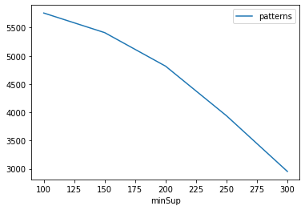
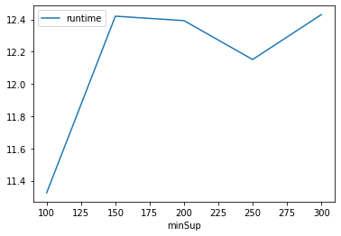
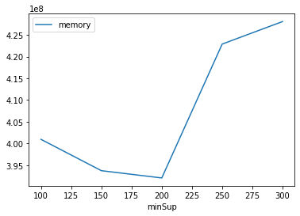

# Advanced Tutorial on Implementing CPGrowth Algorithm

In this tutorial, we will discuss the second approach to find Correlated Patterns in big data using CPGrowth algorithm.


[__Advanced approach:__](#advApproach) Here, we generalize the basic approach by presenting the steps to discover frequent patterns using multiple minimum support values.

***

#### In this tutorial, we explain how the Correlated Pattern Growth (CPGrowth) algorithm  can be implemented by varying the minimum support values

#### Step 1: Import the CPGrowth algorithm and pandas data frame

```python
from PAMI.correlatedPattern.basic import CPGrowth as alg
import pandas as pd
```

#### Step 2: Specify the following input parameters


```python
inputFile = 'transactional_T10I4D100K.csv'
seperator='\t'
minAllConfCount=0.1
minimumSupportCountList = [100, 150, 200, 250, 300] 
#minimumSupport can also specified between 0 to 1. E.g., minSupList = [0.005, 0.006, 0.007, 0.008, 0.009]

result = pd.DataFrame(columns=['algorithm', 'minSup',"minAllConf" , 'patterns', 'runtime', 'memory']) 
#initialize a data frame to store the results of CPGrowth algorithm
```

#### Step 3: Execute the CPGrowth algorithm using a for loop


```python
algorithm = 'CPGrowth'  #specify the algorithm name
for minSupCount in minimumSupportCountList:
    obj = alg.CPGrowth('transactional_T10I4D100K.csv', minSup=minSupCount,minAllConf=minAllConfCount , sep=seperator)
    obj.startMine()
    #store the results in the data frame
    result.loc[result.shape[0]] = [algorithm, minSupCount,minAllConfCount, len(obj.getPatterns()), obj.getRuntime(), obj.getMemoryRSS()]

```

    Correlated Frequent patterns were generated successfully using CorrelatedPatternGrowth algorithm
    Correlated Frequent patterns were generated successfully using CorrelatedPatternGrowth algorithm
    Correlated Frequent patterns were generated successfully using CorrelatedPatternGrowth algorithm
    Correlated Frequent patterns were generated successfully using CorrelatedPatternGrowth algorithm
    Correlated Frequent patterns were generated successfully using CorrelatedPatternGrowth algorithm


```python
print(result)
```

      algorithm  minSup  minAllConf  patterns    runtime     memory
    0  CPGrowth     100         0.1      5758  11.325850  400949248
    1  CPGrowth     150         0.1      5411  12.419876  393736192
    2  CPGrowth     200         0.1      4817  12.392334  392060928
    3  CPGrowth     250         0.1      3939  12.151282  422891520
    4  CPGrowth     300         0.1      2953  12.429438  428077056


#### Step 5: Visualizing the results

##### Step 5.1 Importing the plot library


```python
from PAMI.extras.graph import plotLineGraphsFromDataFrame as plt
```

##### Step 5.2. Plotting the number of patterns


```python
ab = plt.plotGraphsFromDataFrame(result)
ab.plotGraphsFromDataFrame() #drawPlots()
```


    

    


    Graph for No Of Patterns is successfully generated!


    

    


    Graph for Runtime taken is successfully generated!


    

    


    Graph for memory consumption is successfully generated!


### Step 6: Saving the results as latex files


```python
from PAMI.extras.graph import generateLatexFileFromDataFrame as gdf
gdf.generateLatexCode(result)
```

    Latex files generated successfully

