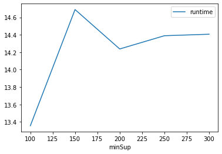
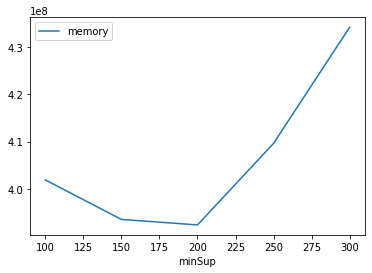

# Advanced Tutorial on Implementing CPGrowthPlus Algorithm

In this tutorial, we will discuss the first approach to find correlated patterns in big data using CPGrowthPlus algorithm.

[__Advanced approach:__](#advApproach) Here, we generalize the basic approach by presenting the steps to discover correlated patterns using multiple minimum support values.

***

#### In this tutorial, we explain how the Correlated Pattern GrowthPlus (CPGrowthPlus) algorithm  can be implemented by varying the minimum support values

#### Step 1: Import the CPGrowthPlus algorithm and pandas data frame


```python
from PAMI.correlatedPattern.basic import CPGrowthPlus  as alg
import pandas as pd
```

#### Step 2: Specify the following input parameters


```python
inputFile = 'transactional_T10I4D100K.csv'
seperator='\t'
minAllConfCount=0.1
minimumSupportCountList = [100, 150, 200, 250, 300] 
#minimumSupport can also specified between 0 to 1. E.g., minSupList = [0.005, 0.006, 0.007, 0.008, 0.009]

result = pd.DataFrame(columns=['algorithm', 'minSup',"minAllConf" , 'patterns', 'runtime', 'memory']) 
#initialize a data frame to store the results of CPGrowthPlus algorithm
```

#### Step 3: Execute the CPGrowthPlus algorithm using a for loop


```python
algorithm = 'CPGrowthPlus'  #specify the algorithm name
for minSupCount in minimumSupportCountList:
    obj = alg.CPGrowthPlus('transactional_T10I4D100K.csv', minSup=minSupCount,minAllConf=minAllConfCount , sep=seperator)
    obj.startMine()
    #store the results in the data frame
    result.loc[result.shape[0]] = [algorithm, minSupCount,minAllConfCount, len(obj.getPatterns()), obj.getRuntime(), obj.getMemoryRSS()]

```

    Correlated Frequent patterns were generated successfully using CorrelatedPatternGrowth algorithm
    Correlated Frequent patterns were generated successfully using CorrelatedPatternGrowth algorithm
    Correlated Frequent patterns were generated successfully using CorrelatedPatternGrowth algorithm
    Correlated Frequent patterns were generated successfully using CorrelatedPatternGrowth algorithm
    Correlated Frequent patterns were generated successfully using CorrelatedPatternGrowth algorithm


```python
print(result)
```

          algorithm  minSup  minAllConf  patterns    runtime     memory
    0  CPGrowthPlus     100         0.1      5758  13.355062  401932288
    1  CPGrowthPlus     150         0.1      5411  14.690512  393605120
    2  CPGrowthPlus     200         0.1      4817  14.237402  392445952
    3  CPGrowthPlus     250         0.1      3939  14.389646  409628672
    4  CPGrowthPlus     300         0.1      2953  14.406934  434098176


#### Step 5: Visualizing the results

##### Step 5.1 Importing the plot library


```python
from PAMI.extras.graph import plotLineGraphsFromDataFrame as plt
```

##### Step 5.2. Plotting the number of patterns


```python
ab = plt.plotGraphsFromDataFrame(result)
ab.plotGraphsFromDataFrame() #drawPlots()
```


    

    


    Graph for No Of Patterns is successfully generated!


    

    


    Graph for Runtime taken is successfully generated!


    

    


    Graph for memory consumption is successfully generated!


### Step 6: Saving the results as latex files


```python
from PAMI.extras.graph import generateLatexFileFromDataFrame as gdf
gdf.generateLatexCode(result)
```

    Latex files generated successfully


```python

```
