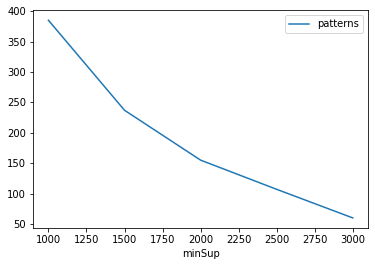
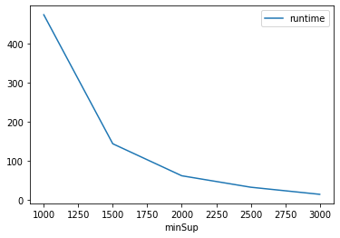
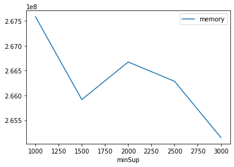

# Advanced Tutorial on Implementing Apriori Algorithm

In this tutorial, we will discuss the second approach to find frequent patterns in big data using Apriori algorithm.

[__Advanced approach:__](#advApproach) Here, we generalize the basic approach by presenting the steps to discover frequent patterns using multiple minimum support values.

***

#### In this tutorial, we explain how the Apriori algorithm  can be implemented by varying the minimum support values

#### Step 1: Import the Apriori algorithm and pandas data frame


```python
from PAMI.frequentPattern.basic import Apriori  as alg
import pandas as pd
```

#### Step 2: Specify the following input parameters


```python
inputFile = 'transactional_T10I4D100K.csv'
seperator='\t'
minimumSupportCountList = [1000, 1500, 2000, 2500, 3000] 
#minimumSupport can also specified between 0 to 1. E.g., minSupList = [0.005, 0.006, 0.007, 0.008, 0.009]

result = pd.DataFrame(columns=['algorithm', 'minSup', 'patterns', 'runtime', 'memory']) 
#initialize a data frame to store the results of Apriori algorithm
```

#### Step 3: Execute the Apriori algorithm using a for loop


```python
algorithm = 'Apriori'  #specify the algorithm name
for minSupCount in minimumSupportCountList:
    obj = alg.Apriori('transactional_T10I4D100K.csv', minSup=minSupCount, sep=seperator)
    obj.startMine()
    #store the results in the data frame
    result.loc[result.shape[0]] = [algorithm, minSupCount, len(obj.getPatterns()), obj.getRuntime(), obj.getMemoryRSS()]

```

    Frequent patterns were generated successfully using Apriori algorithm 
    Frequent patterns were generated successfully using Apriori algorithm 
    Frequent patterns were generated successfully using Apriori algorithm 
    Frequent patterns were generated successfully using Apriori algorithm 
    Frequent patterns were generated successfully using Apriori algorithm 


```python
print(result)
```

      algorithm  minSup  patterns     runtime     memory
    0   Apriori    1000       385  475.068978  267587584
    1   Apriori    1500       237  143.686844  265916416
    2   Apriori    2000       155   61.478595  266674176
    3   Apriori    2500       107   32.063800  266285056
    4   Apriori    3000        60   13.817097  265150464


#### Step 5: Visualizing the results

##### Step 5.1 Importing the plot library


```python
from PAMI.extras.graph import plotLineGraphsFromDataFrame as plt
```

##### Step 5.2. Plotting the number of patterns


```python
ab = plt.plotGraphsFromDataFrame(result)
ab.plotGraphsFromDataFrame() #drawPlots()
```


    

    


    Graph for No Of Patterns is successfully generated!


    

    


    Graph for Runtime taken is successfully generated!


    

    


    Graph for memory consumption is successfully generated!


### Step 6: Saving the results as latex files

```python
from PAMI.extras.graph import DF2Tex as gdf

gdf.generateLatexCode(result)
```

    Latex files generated successfully


```python

```
