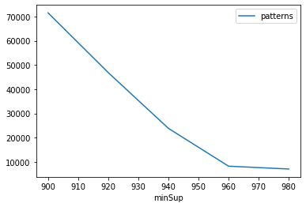
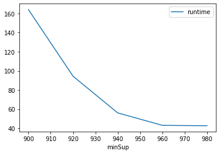
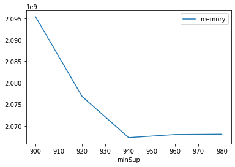

# Advanced Tutorial on Implementing ECLATDiffset Algorithm

In this tutorial, we will discuss the second approach to find frequent patterns in big data using ECLATDiffset algorithm.

[__Advanced approach:__](#advApproach) Here, we generalize the basic approach by presenting the steps to discover frequent patterns using multiple minimum support values.

***

#### In this tutorial, we explain how the ECLATDiffset algorithm  can be implemented by varying the minimum support values

#### Step 1: Import the ECLATDifset algorithm and pandas data frame


```python
from PAMI.frequentPattern.basic import ECLATDiffset  as alg
import pandas as pd
```

#### Step 2: Specify the following input parameters


```python
inputFile = 'Transactional_chess1.csv'
seperator = '\t'
minimumSupportCountList = [900, 920, 940, 960, 980] 
#minimumSupport can also specified between 0 to 1. E.g., minSupList = [0.005, 0.006, 0.007, 0.008, 0.009]

result = pd.DataFrame(columns=['algorithm', 'minSup', 'patterns', 'runtime', 'memory']) 
#initialize a data frame to store the results of ECLATbitset algorithm
```

#### Step 3: Execute the ECLATbitset algorithm using a for loop


```python
algorithm = 'ECLATDiffset'  #specify the algorithm name
for minSupCount in minimumSupportCountList:
    obj = alg.ECLATDiffset(inputFile, minSup=minSupCount, sep=seperator)
    obj.startMine()
    #store the results in the data frame
    result.loc[result.shape[0]] = [algorithm, minSupCount, len(obj.getPatterns()), obj.getRuntime(), obj.getMemoryRSS()]

```

    Frequent patterns were generated successfully using ECLAT Diffset algorithm
    Frequent patterns were generated successfully using ECLAT Diffset algorithm
    Frequent patterns were generated successfully using ECLAT Diffset algorithm
    Frequent patterns were generated successfully using ECLAT Diffset algorithm
    Frequent patterns were generated successfully using ECLAT Diffset algorithm


```python
print(result)
```

          algorithm  minSup  patterns     runtime      memory
    0  ECLATDiffset     900     71544  164.118896  2095386624
    1  ECLATDiffset     920     46879   94.387499  2076844032
    2  ECLATDiffset     940     23856   56.067637  2067283968
    3  ECLATDiffset     960      8235   43.064308  2068004864
    4  ECLATDiffset     980      7065   42.632399  2068078592


#### Step 5: Visualizing the results

##### Step 5.1 Importing the plot library


```python
from PAMI.extras.graph import plotLineGraphsFromDataFrame as plt
```

##### Step 5.2. Plotting the number of patterns


```python
ab = plt.plotGraphsFromDataFrame(result)
ab.plotGraphsFromDataFrame() #drawPlots()
```


    

    


    Graph for No Of Patterns is successfully generated!


    

    


    Graph for Runtime taken is successfully generated!


    

    


    Graph for memory consumption is successfully generated!


### Step 6: Saving the results as latex files


```python
from PAMI.extras.graph import generateLatexFileFromDataFrame as gdf
gdf.generateLatexCode(result)
```

    Latex files generated successfully


```python

```
