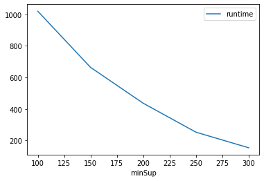
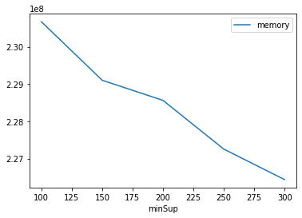

# Advanced Tutorial on Implementing ECLATbitset Algorithm

In this tutorial, we will discuss the second approach to find frequent patterns in big data using ECLATbitset algorithm.

[__Advanced approach:__](#advApproach) Here, we generalize the basic approach by presenting the steps to discover frequent patterns using multiple minimum support values.

***

#### In this tutorial, we explain how the ECLATbitset algorithm  can be implemented by varying the minimum support values

#### Step 1: Import the ECLATbitset algorithm and pandas data frame


```python
from PAMI.frequentPattern.basic import ECLATbitset  as alg
import pandas as pd
```

#### Step 2: Specify the following input parameters


```python
inputFile = 'transactional_T10I4D100K.csv'
seperator='\t'
minimumSupportCountList = [100, 150, 200, 250, 300] 
#minimumSupport can also specified between 0 to 1. E.g., minSupList = [0.005, 0.006, 0.007, 0.008, 0.009]

result = pd.DataFrame(columns=['algorithm', 'minSup', 'patterns', 'runtime', 'memory']) 
#initialize a data frame to store the results of ECLATbitset algorithm
```

#### Step 3: Execute the ECLATbitset algorithm using a for loop


```python
algorithm = 'ECLATbitset'  #specify the algorithm name
for minSupCount in minimumSupportCountList:
    obj = alg.ECLATbitset('transactional_T10I4D100K.csv', minSup=minSupCount, sep=seperator)
    obj.startMine()
    #store the results in the data frame
    result.loc[result.shape[0]] = [algorithm, minSupCount, len(obj.getPatterns()), obj.getRuntime(), obj.getMemoryRSS()]

```

    Frequent patterns were generated successfully using Eclat_bitset algorithm
    Frequent patterns were generated successfully using Eclat_bitset algorithm
    Frequent patterns were generated successfully using Eclat_bitset algorithm
    Frequent patterns were generated successfully using Eclat_bitset algorithm
    Frequent patterns were generated successfully using Eclat_bitset algorithm


```python
print(result)
```

         algorithm  minSup  patterns      runtime     memory
    0  ECLATbitset     100     27532  1019.680960  230670336
    1  ECLATbitset     150     19126   663.871636  229101568
    2  ECLATbitset     200     13255   436.363724  228560896
    3  ECLATbitset     250      7703   252.914996  227254272
    4  ECLATbitset     300      4552   154.023898  226435072


#### Step 5: Visualizing the results

##### Step 5.1 Importing the plot library


```python
from PAMI.extras.graph import plotLineGraphsFromDataFrame as plt
```

##### Step 5.2. Plotting the number of patterns


```python
ab = plt.plotGraphsFromDataFrame(result)
ab.plotGraphsFromDataFrame() #drawPlots()
```


    

    


    Graph for No Of Patterns is successfully generated!


    

    


    Graph for Runtime taken is successfully generated!


    

    


    Graph for memory consumption is successfully generated!


### Step 6: Saving the results as latex files

```python
from PAMI.extras.graph import DF2Tex as gdf

gdf.generateLatexCode(result)
```

    Latex files generated successfully


```python

```
