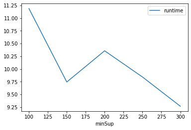
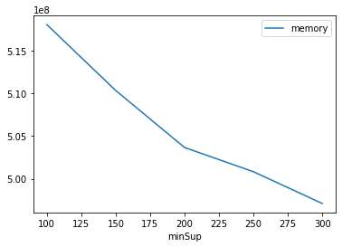

# Advanced Tutorial on Implementing Frequent-Pattern Growth Algorithm

In this tutorial, we will discuss the second approach to find frequent patterns in big data using ECLATDiffset algorithm.

[__Advanced approach:__](#advApproach) Here, we generalize the basic approach by presenting the steps to discover frequent patterns using multiple minimum support values.

***

#### In this tutorial, we explain how the Frequent Pattern-growth (FP-growth) algorithm  can be implemented by varying the minimum support values

#### Step 1: Import the FP-growth algorithm and pandas data frame


```python
from PAMI.frequentPattern.basic import FPGrowth  as alg
import pandas as pd
```

#### Step 2: Specify the following input parameters


```python
inputFile = 'transactional_T10I4D100K.csv'
seperator='\t'
minimumSupportCountList = [100, 150, 200, 250, 300] 
#minimumSupport can also specified between 0 to 1. E.g., minSupList = [0.005, 0.006, 0.007, 0.008, 0.009]

result = pd.DataFrame(columns=['algorithm', 'minSup', 'patterns', 'runtime', 'memory']) 
#initialize a data frame to store the results of FP-growth algorithm
```

#### Step 3: Execute the FP-growth algorithm using a for loop


```python
algorithm = 'FPGrowth'  #specify the algorithm name
for minSupCount in minimumSupportCountList:
    obj = alg.FPGrowth('transactional_T10I4D100K.csv', minSup=minSupCount, sep=seperator)
    obj.startMine()
    #store the results in the data frame
    result.loc[result.shape[0]] = [algorithm, minSupCount, len(obj.getPatterns()), obj.getRuntime(), obj.getMemoryRSS()]

```

    Frequent patterns were generated successfully using frequentPatternGrowth algorithm
    Frequent patterns were generated successfully using frequentPatternGrowth algorithm
    Frequent patterns were generated successfully using frequentPatternGrowth algorithm
    Frequent patterns were generated successfully using frequentPatternGrowth algorithm
    Frequent patterns were generated successfully using frequentPatternGrowth algorithm


```python
print(result)
```

      algorithm  minSup  patterns    runtime     memory
    0  FPGrowth     100     27532  11.189378  518057984
    1  FPGrowth     150     19126   9.745891  510345216
    2  FPGrowth     200     13255  10.359092  503660544
    3  FPGrowth     250      7703   9.844441  500826112
    4  FPGrowth     300      4552   9.269739  497098752


#### Step 5: Visualizing the results

##### Step 5.1 Importing the plot library


```python
from PAMI.extras.graph import plotLineGraphsFromDataFrame as plt
```

##### Step 5.2. Plotting the number of patterns


```python
ab = plt.plotGraphsFromDataFrame(result)
ab.plotGraphsFromDataFrame() #drawPlots()
```


    

    


    Graph for No Of Patterns is successfully generated!


    

    


    Graph for Runtime taken is successfully generated!


    

    


    Graph for memory consumption is successfully generated!


### Step 6: Saving the results as latex files


```python
from PAMI.extras.graph import generateLatexFileFromDataFrame as gdf
gdf.generateLatexCode(result)
```

    Latex files generated successfully

