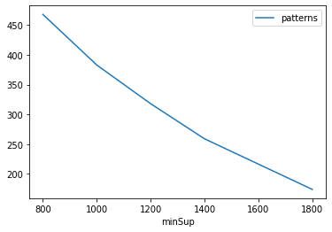
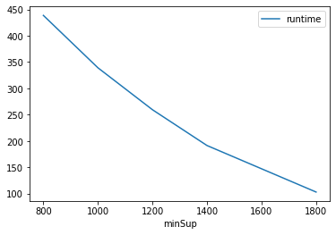
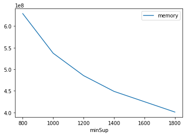

# Advanced Tutorial on Implementing FCPGrowth Algorithm

In this tutorial, we will discuss the second approach to find Fuzzy Correlated Patterns in big data using FCPGrowth algorithm.

[__Advanced approach:__](#advApproach) Here, we generalize the basic approach by presenting the steps to discover Fuzzy Correlated Patterns using multiple minimum support values.

***

#### In this tutorial, we explain how the FCPGrowth algorithm  can be implemented by varying the minimum support values

#### Step 1: Import the FCPGrowth algorithm and pandas data frame


```python
from PAMI.fuzzyCorrelatedPattern.basic import FCPGrowth  as alg
import pandas as pd
```

#### Step 2: Specify the following input parameters


```python
inputFile = 'fuzzy_T10I4D100K.csv'

minimumSupportCountList=[800,1000,1200,1400,1800]  #Users can also specify this constraint between 0 to 1.
ratioEx=0.8
seperator='\t'  
result = pd.DataFrame(columns=['algorithm', 'minSup', 'patterns', 'runtime', 'memory']) 
#initialize a data frame to store the results of FCPGrowth algorithm
```

#### Step 3: Execute the FCPGrowth algorithm using a for loop


```python
algorithm = 'FCPGrowth'  #specify the algorithm name
for minSupCount in minimumSupportCountList:
    obj = alg.FCPGrowth(iFile=inputFile, minSup=minSupCount,ratio=ratioEx, sep=seperator)
    obj.startMine()
    #store the results in the data frame
    result.loc[result.shape[0]] = [algorithm, minSupCount, len(obj.getPatterns()), obj.getRuntime(), obj.getMemoryRSS()]

```

    Fuzzy Correlated Patterns Successfully generated using FCPGrowth algorithms
    Fuzzy Correlated Patterns Successfully generated using FCPGrowth algorithms
    Fuzzy Correlated Patterns Successfully generated using FCPGrowth algorithms
    Fuzzy Correlated Patterns Successfully generated using FCPGrowth algorithms
    Fuzzy Correlated Patterns Successfully generated using FCPGrowth algorithms


```python
print(result)
```

       algorithm  minSup  patterns     runtime     memory
    0  FCPGrowth     800       468  438.653513  628961280
    1  FCPGrowth    1000       383  339.194458  537227264
    2  FCPGrowth    1200       318  259.559553  485363712
    3  FCPGrowth    1400       259  191.587869  448913408
    4  FCPGrowth    1800       174  103.250598  401055744


#### Step 5: Visualizing the results

##### Step 5.1 Importing the plot library


```python
from PAMI.extras.graph import plotLineGraphsFromDataFrame as plt
```

##### Step 5.2. Plotting the number of patterns


```python
ab = plt.plotGraphsFromDataFrame(result)
ab.plotGraphsFromDataFrame() #drawPlots()
```


    

    


    Graph for No Of Patterns is successfully generated!


    

    


    Graph for Runtime taken is successfully generated!


    

    


    Graph for memory consumption is successfully generated!


### Step 6: Saving the results as latex files

```python
from PAMI.extras.graph import DF2Tex as gdf

gdf.generateLatexCode(result)
```

    Latex files generated successfully

