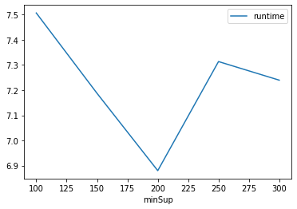
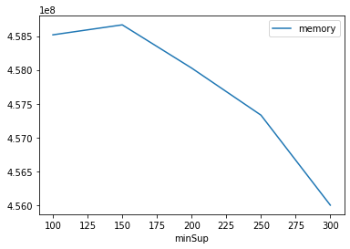

# Advanced Tutorial on Implementing FFSPMiner Algorithm

In this tutorial, we will discuss the first approach to find Fuzzy Frequent Spatial Pattern in big data using FFSPMiner algorithm.

[__Advanced approach:__](#advApproach) Here, we generalize the basic approach by presenting the steps to discover Fuzzy Frequent Spatial Pattern using multiple minimum support values.

***

#### In this tutorial, we explain how the FFSPMiner algorithm  can be implemented by varying the minimum support values

#### Step 1: Import the FFSPMiner algorithm and pandas data frame


```python
from PAMI.fuzzyFrequentSpatialPattern.basic import FFSPMiner  as alg
import pandas as pd
```

#### Step 2: Specify the following input parameters


```python
inputFile = 'fuzzyTransactional_T10I4D100K.csv'

minimumSupportCountList=[100,150,200,250,300]  #Users can also specify this constraint between 0 to 1.
seperator=' '
neighborFile='fuzzy_T10I4D100K_neighbour.csv'
result = pd.DataFrame(columns=['algorithm', 'minSup', 'patterns', 'runtime', 'memory']) 
#initialize a data frame to store the results of FFSPMiner algorithm
```

#### Step 3: Execute the FFSPMiner algorithm using a for loop


```python
algorithm = 'FFSPMiner'  #specify the algorithm name
for minSupCount in minimumSupportCountList:
    obj = alg.FFSPMiner(iFile=inputFile,nFile=neighborFile, minSup=minSupCount, sep=seperator)
    obj.startMine()
    #store the results in the data frame
    result.loc[result.shape[0]] = [algorithm, minSupCount, len(obj.getPatterns()), obj.getRuntime(), obj.getMemoryRSS()]

```


```python
print(result)
```

       algorithm  minSup  patterns   runtime     memory
    0  FFSPMiner     100       797  7.506250  458518528
    1  FFSPMiner     150       765  7.187267  458665984
    2  FFSPMiner     200       740  6.880144  458027008
    3  FFSPMiner     250       717  7.313266  457330688
    4  FFSPMiner     300       690  7.239387  455999488


#### Step 5: Visualizing the results

##### Step 5.1 Importing the plot library


```python
from PAMI.extras.graph import plotLineGraphsFromDataFrame as plt
```

##### Step 5.2. Plotting the number of patterns


```python
ab = plt.plotGraphsFromDataFrame(result)
ab.plotGraphsFromDataFrame() #drawPlots()
```


    

    


    Graph for No Of Patterns is successfully generated!


    

    


    Graph for Runtime taken is successfully generated!


    

    


    Graph for memory consumption is successfully generated!


### Step 6: Saving the results as latex files


```python
from PAMI.extras.graph import generateLatexFileFromDataFrame as gdf
gdf.generateLatexCode(result)
```

    Latex files generated successfully

