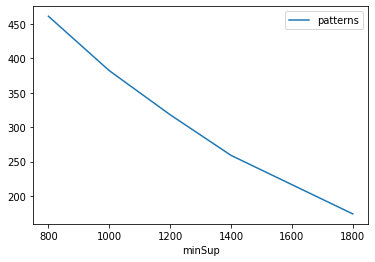
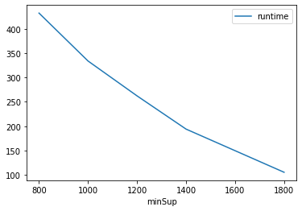
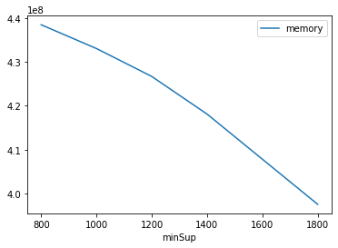

# Advanced Tutorial on Implementing FPFPMiner Algorithm

In this tutorial, we will discuss the second approach to find Fuzzy Periodic Frequent Pattern in big data using FPFPMiner algorithm.

[__Advanced approach:__](#advApproach) Here, we generalize the basic approach by presenting the steps to discover Fuzzy Periodic Frequent Pattern using multiple minimum support values.

***

#### In this tutorial, we explain how the FPFPMiner algorithm  can be implemented by varying the minimum support values

#### Step 1: Import the FPFPMiner algorithm and pandas data frame

```python
from PAMI.fuzzyPeriodicFrequentPattern.basic import FPFPMiner_old  as alg
import pandas as pd
```

#### Step 2: Specify the following input parameters


```python
inputFile = 'fuzzyTemporal_T10I4D100K.csv'

minimumSupportCountList=[800,1000,1200,1400,1800]  #Users can also specify this constraint between 0 to 1.
periodCount=1000
seperator=' '  
result = pd.DataFrame(columns=['algorithm', 'minSup', 'patterns', 'runtime', 'memory']) 
#initialize a data frame to store the results of FPFPMiner algorithm
```

#### Step 3: Execute the FPFPMiner algorithm using a for loop


```python
algorithm = 'FPFPMiner'  #specify the algorithm name
for minSupCount in minimumSupportCountList:
    obj = alg.FPFPMiner(iFile=inputFile, minSup=minSupCount,period=periodCount, sep=seperator)
    obj.startMine()
    #store the results in the data frame
    result.loc[result.shape[0]] = [algorithm, minSupCount, len(obj.getPatterns()), obj.getRuntime(), obj.getMemoryRSS()]

```


```python
print(result)
```

       algorithm  minSup  patterns     runtime     memory
    0  FPFPMiner     800       461  432.156967  438480896
    1  FPFPMiner    1000       382  333.833456  433057792
    2  FPFPMiner    1200       318  262.252220  426692608
    3  FPFPMiner    1400       259  194.049791  418111488
    4  FPFPMiner    1800       174  105.433530  397541376


#### Step 5: Visualizing the results

##### Step 5.1 Importing the plot library


```python
from PAMI.extras.graph import plotLineGraphsFromDataFrame as plt
```

##### Step 5.2. Plotting the number of patterns


```python
ab = plt.plotGraphsFromDataFrame(result)
ab.plotGraphsFromDataFrame() #drawPlots()
```


    

    


    Graph for No Of Patterns is successfully generated!


    

    


    Graph for Runtime taken is successfully generated!


    

    


    Graph for memory consumption is successfully generated!


### Step 6: Saving the results as latex files

```python
from PAMI.extras.graph import DF2Tex as gdf

gdf.generateLatexCode(result)
```

    Latex files generated successfully

