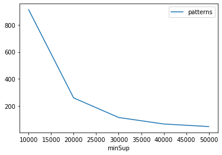
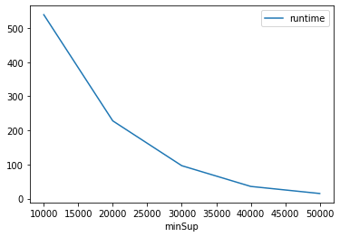
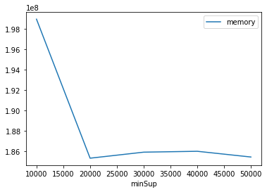

# Advanced Tutorial on Implementing EFIM Algorithm

In this tutorial, we will discuss the second approach to find High Utility patterns in big data using EFIM algorithm.

[__Advanced approach:__](#advApproach) Here, we generalize the basic approach by presenting the steps to discover High Utility patterns using multiple minimum utility values.

***

#### In this tutorial, we explain how the EFIM algorithm  can be implemented by varying the minimum utility values

#### Step 1: Import the EFIM algorithm and pandas data frame

```python
from PAMI.highUtilityPattern.basic import EFIM  as alg
import pandas as pd
```

#### Step 2: Specify the following input parameters


```python
inputFile = 'Utility_T10I4D100K.csv'
minUtilList = [10000, 20000, 30000, 40000, 50000]
seperator = '\t'      
result = pd.DataFrame(columns=['algorithm', 'minSup', 'patterns', 'runtime', 'memory']) 
#initialize a data frame to store the results of EFIM algorithm
```

#### Step 3: Execute the EFIM algorithm using a for loop


```python
algorithm = 'EFIM'  #specify the algorithm name
for minimumUtility in minUtilList:
    obj = alg.EFIM(iFile=inputFile, minUtil=minimumUtility, sep=seperator)
    obj.startMine()
    #store the results in the data frame
    result.loc[result.shape[0]] = [algorithm, minimumUtility, len(obj.getPatterns()), obj.getRuntime(), obj.getMemoryRSS()]
```

    High Utility patterns were generated successfully using EFIM algorithm
    High Utility patterns were generated successfully using EFIM algorithm
    High Utility patterns were generated successfully using EFIM algorithm
    High Utility patterns were generated successfully using EFIM algorithm
    High Utility patterns were generated successfully using EFIM algorithm


```python
print(result)
```

      algorithm  minSup  patterns     runtime     memory
    0      EFIM   10000       912  539.105205  198959104
    1      EFIM   20000       259  227.928297  185344000
    2      EFIM   30000       114   96.548299  185933824
    3      EFIM   40000        66   35.776912  186019840
    4      EFIM   50000        47   15.013083  185458688


#### Step 5: Visualizing the results

##### Step 5.1 Importing the plot library


```python
from PAMI.extras.graph import plotLineGraphsFromDataFrame as plt
```

##### Step 5.2. Plotting the number of patterns


```python
ab = plt.plotGraphsFromDataFrame(result)
ab.plotGraphsFromDataFrame() #drawPlots()
```


    

    


    Graph for No Of Patterns is successfully generated!


    

    


    Graph for Runtime taken is successfully generated!


    

    


    Graph for memory consumption is successfully generated!


### Step 6: Saving the results as latex files


```python
from PAMI.extras.graph import generateLatexFileFromDataFrame as gdf
gdf.generateLatexCode(result)
```

    Latex files generated successfully

