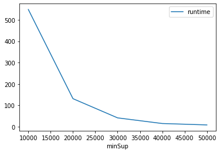
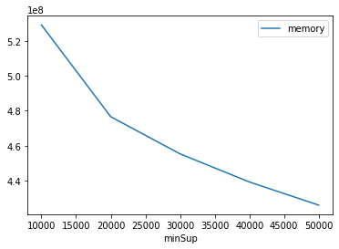

# Advanced Tutorial on Implementing HMiner Algorithm

In this tutorial, we will discuss the second approach to find High Utility patterns in big data using HMiner algorithm.

[__Advanced approach:__](#advApproach) Here, we generalize the basic approach by presenting the steps to discover High Utility patterns using multiple minimum utility values.

***

#### In this tutorial, we explain how the HMiner algorithm  can be implemented by varying the minimum utility values

#### Step 1: Import the HMiner algorithm and pandas data frame

```python
from PAMI.highUtilityPattern.basic import HMiner  as alg
import pandas as pd
```

#### Step 2: Specify the following input parameters


```python
inputFile = 'Utility_T10I4D100K.csv'
minUtilList=[10000, 20000, 30000, 40000, 50000]
seperator=' '      
result = pd.DataFrame(columns=['algorithm', 'minSup', 'patterns', 'runtime', 'memory']) 
#initialize a data frame to store the results of HMiner algorithm
```

#### Step 3: Execute the HMiner algorithm using a for loop


```python
algorithm = 'HMiner'  #specify the algorithm name
for minimumUtility in minUtilList:
    obj = alg.HMiner(iFile1=inputFile, minUtil=minimumUtility, sep=seperator)
    obj.startMine()
    #store the results in the data frame
    result.loc[result.shape[0]] = [algorithm, minimumUtility, len(obj.getPatterns()), obj.getRuntime(), obj.getMemoryRSS()]
```

    High Utility patterns were generated successfully using HMiner algorithm
    High Utility patterns were generated successfully using HMiner algorithm
    High Utility patterns were generated successfully using HMiner algorithm
    High Utility patterns were generated successfully using HMiner algorithm
    High Utility patterns were generated successfully using HMiner algorithm


```python
print(result)
```

      algorithm  minSup  patterns     runtime     memory
    0    HMiner   10000       912  548.168591  529215488
    1    HMiner   20000       259  131.339580  476606464
    2    HMiner   30000       114   41.597492  455356416
    3    HMiner   40000        66   15.249419  439250944
    4    HMiner   50000        47    8.647581  425992192


#### Step 5: Visualizing the results

##### Step 5.1 Importing the plot library


```python
from PAMI.extras.graph import plotLineGraphsFromDataFrame as plt
```

##### Step 5.2. Plotting the number of patterns


```python
ab = plt.plotGraphsFromDataFrame(result)
ab.plotGraphsFromDataFrame() #drawPlots()
```


    

    


    Graph for No Of Patterns is successfully generated!


    

    


    Graph for Runtime taken is successfully generated!


    

    


    Graph for memory consumption is successfully generated!


### Step 6: Saving the results as latex files


```python
from PAMI.extras.graph import generateLatexFileFromDataFrame as gdf
gdf.generateLatexCode(result)
```

    Latex files generated successfully

