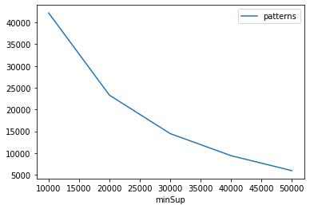
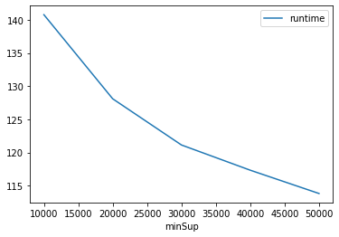
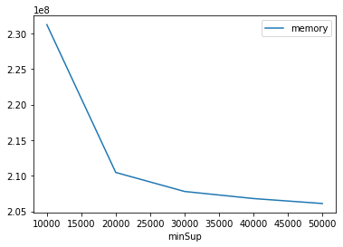

# Advanced Tutorial on Implementing RHUIM Algorithm

In this tutorial, we will discuss the second approach to find Relative High Utility patterns in big data using RHUIM algorithm.

[__Advanced approach:__](#advApproach) Here, we generalize the basic approach by presenting the steps to discover Relative High Utility patterns using multiple minimum utility values.

***

#### In this tutorial, we explain how the RHUIM algorithm  can be implemented by varying the minimum utility values

#### Step 1: Import the RHUIM algorithm and pandas data frame

```python
from PAMI.relativeHighUtilityPattern.basic import RHUIM as alg
import pandas as pd
```

#### Step 2: Specify the following input parameters


```python
inputFile = 'Utility_T10I4D100K.csv'
minUtilList=[10000, 20000, 30000, 40000, 50000]
minUtilRatio = 0.6
seperator='\t'      
result = pd.DataFrame(columns=['algorithm', 'minSup', 'patterns', 'runtime', 'memory']) 
#initialize a data frame to store the results of HMiner algorithm
```

#### Step 3: Execute the RHUIM algorithm using a for loop


```python
algorithm = 'RHUIM'  #specify the algorithm name
for minimumUtility in minUtilList:
    obj = alg.RHUIM(iFile=inputFile, minUtil=minimumUtility, minUR=minUtilRatio, sep=seperator)
    obj.startMine()
    #store the results in the data frame
    result.loc[result.shape[0]] = [algorithm, minimumUtility, len(obj.getPatterns()), obj.getRuntime(), obj.getMemoryRSS()]
```

    Relative High Utility patterns were generated successfully using RHUIM algorithm
    Relative High Utility patterns were generated successfully using RHUIM algorithm
    Relative High Utility patterns were generated successfully using RHUIM algorithm
    Relative High Utility patterns were generated successfully using RHUIM algorithm
    Relative High Utility patterns were generated successfully using RHUIM algorithm


```python
print(result)
```

      algorithm  minSup  patterns     runtime     memory
    0     RHUIM   10000     42179  140.764802  231247872
    1     RHUIM   20000     23299  128.099267  210464768
    2     RHUIM   30000     14468  121.137855  207790080
    3     RHUIM   40000      9408  117.338782  206794752
    4     RHUIM   50000      5968  113.827518  206098432


#### Step 5: Visualizing the results

##### Step 5.1 Importing the plot library


```python
from PAMI.extras.graph import plotLineGraphsFromDataFrame as plt
```

##### Step 5.2. Plotting the number of patterns


```python
ab = plt.plotGraphsFromDataFrame(result)
ab.plotGraphsFromDataFrame() #drawPlots()
```


    

    


    Graph for No Of Patterns is successfully generated!


    

    


    Graph for Runtime taken is successfully generated!


    

    


    Graph for memory consumption is successfully generated!


### Step 6: Saving the results as latex files

```python
from PAMI.extras.graph import DF2Tex as gdf

gdf.generateLatexCode(result)
```

    Latex files generated successfully


```python

```
