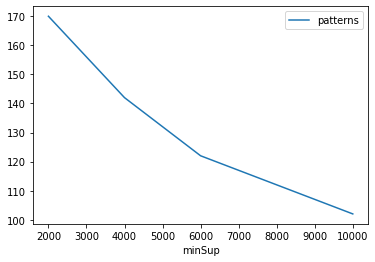
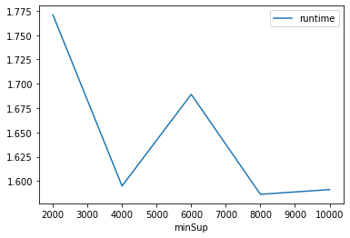
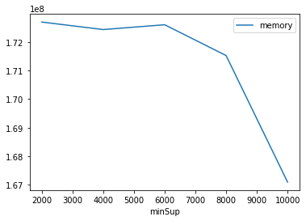

# Advanced Tutorial on Implementing HDSHUIM Algorithm

In this tutorial, we will discuss the first approach to find High Utility Spatial Pattern in big data using HDSHUIM algorithm.

[__Advanced approach:__](#advApproach) Here, we generalize the basic approach by presenting the steps to discover High Utility Spatial Pattern using multiple minimum utility values.

***

#### In this tutorial, we explain how the HDSHUIM algorithm  can be implemented by varying the minimum utility values

#### Step 1: Import the HDSHUIM algorithm and pandas data frame


```python
from PAMI.highUtilitySpatialPattern.basic import HDSHUIM  as alg
import pandas as pd
```

#### Step 2: Specify the following input parameters


```python
inputFile = 'utility_mushroom.txt'
minUtilList = [2000, 4000, 6000, 8000, 10000]
seperator = ' '
neighborFile = 'mushroom_neighbourhoodFile_9.txt'
result = pd.DataFrame(columns=['algorithm', 'minSup', 'patterns', 'runtime', 'memory']) 
#initialize a data frame to store the results of HDSHUIM algorithm
```

#### Step 3: Execute the HDSHUIM algorithm using a for loop


```python
algorithm = 'HDSHUIM'  #specify the algorithm name
for minimumUtility in minUtilList:
    obj = alg.HDSHUIM(iFile=inputFile, nFile=neighborFile, minUtil=minimumUtility, sep=seperator)
    obj.startMine()
    #store the results in the data frame
    result.loc[result.shape[0]] = [algorithm, minimumUtility, len(obj.getPatterns()), obj.getRuntime(), obj.getMemoryRSS()]
```


```python
print(result)
```

      algorithm  minSup  patterns   runtime     memory
    0   HDSHUIM    2000       170  1.770967  172691456
    1   HDSHUIM    4000       142  1.595007  172429312
    2   HDSHUIM    6000       122  1.689212  172597248
    3   HDSHUIM    8000       112  1.586486  171520000
    4   HDSHUIM   10000       102  1.591346  167096320


#### Step 5: Visualizing the results

##### Step 5.1 Importing the plot library


```python
from PAMI.extras.graph import plotLineGraphsFromDataFrame as plt
```

##### Step 5.2. Plotting the number of patterns


```python
ab = plt.plotGraphsFromDataFrame(result)
ab.plotGraphsFromDataFrame() #drawPlots()
```


    

    


    Graph for No Of Patterns is successfully generated!


    

    


    Graph for Runtime taken is successfully generated!


    

    


    Graph for memory consumption is successfully generated!


### Step 6: Saving the results as latex files


```python
from PAMI.extras.graph import generateLatexFileFromDataFrame as gdf
gdf.generateLatexCode(result)
```

    Latex files generated successfully

