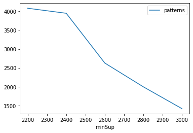
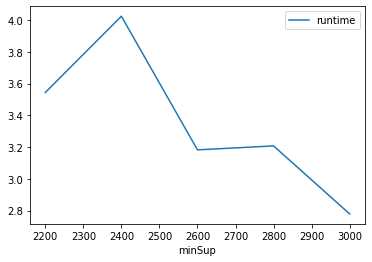
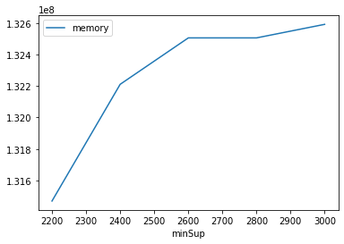

# Advanced Tutorial on Implementing HUFIM Algorithm

In this tutorial, we will discuss the second approach to find High Utility Frequent patterns in big data using HUFIM algorithm.

[__Advanced approach:__](#advApproach) Here, we generalize the basic approach by presenting the steps to discover High Utility Frequent patterns using multiple minimum support values.

***

#### In this tutorial, we explain how the HUFIM algorithm  can be implemented by varying the minimum utility values

#### Step 1: Import the HUFIM algorithm and pandas data frame


```python
from PAMI.highUtilityFrequentPatterns.basic import HUFIM  as alg
import pandas as pd
```

#### Step 2: Specify the following input parameters


```python
inputFile = 'utility_mushroom.txt'
minSupList=[2200, 2400, 2600, 2800, 3000]
minUtil = 50000
seperator = ' '      
result = pd.DataFrame(columns=['algorithm', 'minSup', 'patterns', 'runtime', 'memory']) 
#initialize a data frame to store the results of HMiner algorithm
```

#### Step 3: Execute the HUFIM algorithm using a for loop


```python
algorithm = 'HUFIM'  #specify the algorithm name
for minSup in minSupList:
    obj = alg.HUFIM(iFile=inputFile, minSup=minSup, minUtil=minUtil, sep=seperator)
    obj.startMine()
    #store the results in the data frame
    result.loc[result.shape[0]] = [algorithm, minSup, len(obj.getPatterns()), obj.getRuntime(), obj.getMemoryRSS()]
```

    High Utility Frequent patterns were generated successfully using HUFIM algorithm
    High Utility Frequent patterns were generated successfully using HUFIM algorithm
    High Utility Frequent patterns were generated successfully using HUFIM algorithm
    High Utility Frequent patterns were generated successfully using HUFIM algorithm
    High Utility Frequent patterns were generated successfully using HUFIM algorithm


```python
print(result)
```

      algorithm  minSup  patterns   runtime     memory
    0     HUFIM    2200      4080  3.543843  131469312
    1     HUFIM    2400      3947  4.024087  132210688
    2     HUFIM    2600      2628  3.182598  132505600
    3     HUFIM    2800      1997  3.207395  132505600
    4     HUFIM    3000      1420  2.779103  132591616


#### Step 5: Visualizing the results

##### Step 5.1 Importing the plot library


```python
from PAMI.extras.graph import plotLineGraphsFromDataFrame as plt
```

##### Step 5.2. Plotting the number of patterns


```python
ab = plt.plotGraphsFromDataFrame(result)
ab.plotGraphsFromDataFrame() #drawPlots()
```


    

    


    Graph for No Of Patterns is successfully generated!


    

    


    Graph for Runtime taken is successfully generated!


    

    


    Graph for memory consumption is successfully generated!


### Step 6: Saving the results as latex files


```python
from PAMI.extras.graph import generateLatexFileFromDataFrame as gdf
gdf.generateLatexCode(result)
```

    Latex files generated successfully

