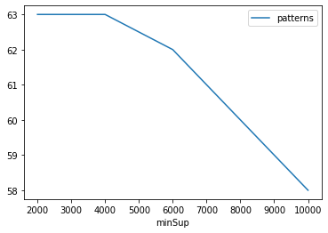
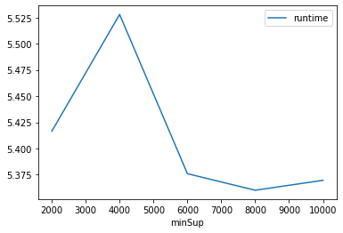
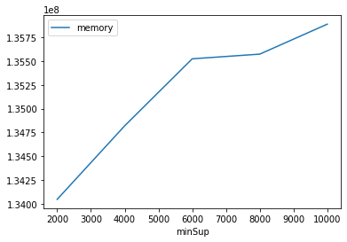

# Advanced Tutorial on Implementing SHUFIM Algorithm

In this tutorial, we will discuss two approaches to find High Utility Frequent Spatial Pattern in big data using SHUFIM algorithm.

[__Advanced approach:__](#advApproach) Here, we generalize the basic approach by presenting the steps to discover High Utility Frequent Spatial Pattern using multiple minimum utility values.

***

#### In this tutorial, we explain how the HDSHUIM algorithm  can be implemented by varying the minimum utility values

#### Step 1: Import the SHUFIM algorithm and pandas data frame


```python
from PAMI.highUtilityFrequentSpatialPattern.basic import SHUFIM  as alg
import pandas as pd
```

#### Step 2: Specify the following input parameters


```python
inputFile = 'utility_mushroom.txt'
minUtilList = [2000, 4000, 6000, 8000, 10000]
minSup = 100
seperator = ' '
neighborFile='mushroom_neighbourhood.txt'
result = pd.DataFrame(columns=['algorithm', 'minSup', 'patterns', 'runtime', 'memory']) 
#initialize a data frame to store the results of HDSHUIM algorithm
```

#### Step 3: Execute the SHUFIM algorithm using a for loop


```python
algorithm = 'SHUFIM'  #specify the algorithm name
for minimumUtility in minUtilList:
    obj = alg.SHUFIM(iFile=inputFile, nFile=neighborFile,minUtil=minimumUtility, minSup=1000, sep=seperator)
    obj.startMine()
    #store the results in the data frame
    result.loc[result.shape[0]] = [algorithm, minimumUtility, len(obj.getPatterns()), obj.getRuntime(), obj.getMemoryRSS()]
```

    Spatial High Utility Frequent Itemsets generated successfully using SHUFIM algorithm
    Spatial High Utility Frequent Itemsets generated successfully using SHUFIM algorithm
    Spatial High Utility Frequent Itemsets generated successfully using SHUFIM algorithm
    Spatial High Utility Frequent Itemsets generated successfully using SHUFIM algorithm
    Spatial High Utility Frequent Itemsets generated successfully using SHUFIM algorithm


#### Step 4: Print the result


```python
print(result)
```

      algorithm  minSup  patterns   runtime     memory
    0    SHUFIM    2000        63  5.416463  134045696
    1    SHUFIM    4000        63  5.528000  134819840
    2    SHUFIM    6000        62  5.375919  135524352
    3    SHUFIM    8000        60  5.360096  135573504
    4    SHUFIM   10000        58  5.369577  135888896


#### Step 5: Visualizing the results

##### Step 5.1 Importing the plot library


```python
from PAMI.extras.graph import plotLineGraphsFromDataFrame as plt
```

##### Step 5.2. Plotting the number of patterns


```python
ab = plt.plotGraphsFromDataFrame(result)
ab.plotGraphsFromDataFrame() #drawPlots()
```


    

    


    Graph for No Of Patterns is successfully generated!


    

    


    Graph for Runtime taken is successfully generated!


    

    


    Graph for memory consumption is successfully generated!


### Step 6: Saving the results as latex files


```python
from PAMI.extras.graph import generateLatexFileFromDataFrame as gdf
gdf.generateLatexCode(result)
```

    Latex files generated successfully

