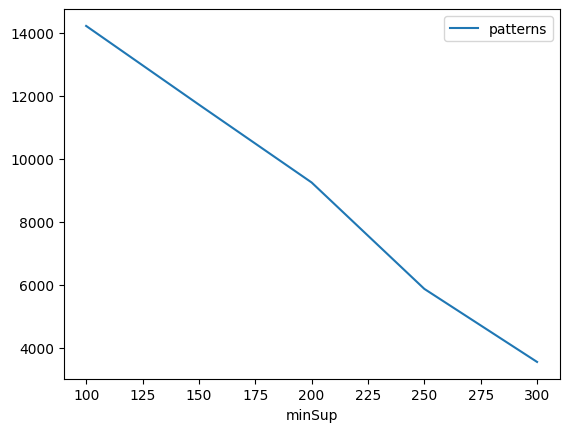
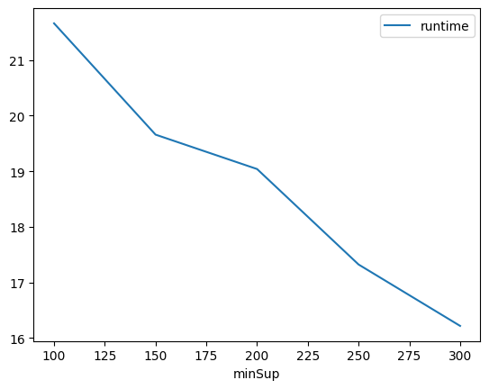
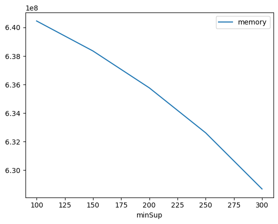

# Advanced Tutorial on Implementing GThreePGrowth Algorithm

In this tutorial, we will discuss the second approach to find Partial Periodic Pattern in big data using GThreePGrowth (G3PGrowth) algorithm.

[__Advanced approach:__](#advApproach) Here, we generalize the basic approach by presenting the steps to discover Partial Periodic Pattern using multiple minimum periodic support values.

***

#### In this tutorial, we explain how the GThreePGrowth algorithm  can be implemented by varying the minimum support values

#### Step 1: Import the GThreePGrowth algorithm and pandas data frame


```python
from PAMI.partialPeriodicPattern.basic import GThreePGrowth  as alg
import pandas as pd
```

#### Step 2: Specify the following input parameters


```python
inputFile = 'temporal_T10I4D100K.csv'
seperator = '\t'
periodCount = 5000
periodicSupportCountList = [100, 150, 200, 250, 300] 
#minimumSupport can also specified between 0 to 1. E.g., minSupList = [0.005, 0.006, 0.007, 0.008, 0.009]
relativePeriodSupportCount = 0.2

result = pd.DataFrame(columns=['algorithm', 'minSup', 'period', 'minRPS','patterns', 'runtime', 'memory']) 
#initialize a data frame to store the results of GThreePGrowth algorithm
```

#### Step 3: Execute the GThreePGrowth algorithm using a for loop


```python
algorithm = 'GThreePGrowth'  #specify the algorithm name
for periodicSupportCount in periodicSupportCountList:
    obj = aalg.GThreePGrowth(iFile=inputFile,periodicSupport=periodicSupportCount, period=periodCount, relativePS=relativePeriodSupportCount, sep=seperator)
    obj.startMine()
    #store the results in the data frame
    result.loc[result.shape[0]] = [algorithm, periodicSupportCount,periodCount,relativePeriodSupportCount, len(obj.getPatterns()), obj.getRuntime(), obj.getMemoryRSS()]
```

    Partial Periodic Patterns were generated successfully using Generalized 3PGrowth algorithm 
    Partial Periodic Patterns were generated successfully using Generalized 3PGrowth algorithm 
    Partial Periodic Patterns were generated successfully using Generalized 3PGrowth algorithm 
    Partial Periodic Patterns were generated successfully using Generalized 3PGrowth algorithm 
    Partial Periodic Patterns were generated successfully using Generalized 3PGrowth algorithm 


#### Step 4: Print the result


```python
print(result)
```

       algorithm  minSup  period  minRPS  patterns    runtime     memory
    0  G3PGrowth     100    5000     0.2     14219  21.660695  640454656
    1  G3PGrowth     150    5000     0.2     11720  19.658405  638353408
    2  G3PGrowth     200    5000     0.2      9247  19.039484  635768832
    3  G3PGrowth     250    5000     0.2      5867  17.321838  632619008
    4  G3PGrowth     300    5000     0.2      3547  16.217452  628686848


#### Step 5: Visualizing the results

##### Step 5.1 Importing the plot library


```python
from PAMI.extras.graph import plotLineGraphsFromDataFrame as plt
```

##### Step 5.2. Plotting the number of patterns


```python
ab = plt.plotGraphsFromDataFrame(result)
ab.plotGraphsFromDataFrame() #drawPlots()
```


    

    


    Graph for No Of Patterns is successfully generated!


    

    


    Graph for Runtime taken is successfully generated!


    

    


    Graph for memory consumption is successfully generated!


### Step 6: Saving the results as latex files

```python
from PAMI.extras.graph import DF2Tex as gdf

gdf.generateLatexCode(result)
```

    Latex files generated successfully

