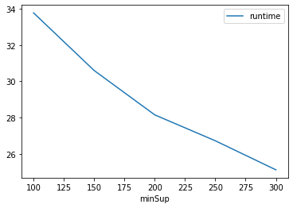
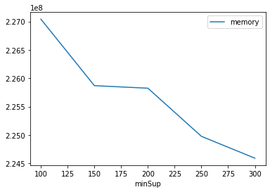

# Advanced Tutorial on Implementing PPP_ECLAT Algorithm

In this tutorial, we will discuss the second approach to find Partial Periodic Pattern in big data using PPP_ECLAT (3PECLAT) algorithm.

[__Advanced approach:__](#advApproach) Here, we generalize the basic approach by presenting the steps to discover Partial Periodic Pattern using multiple minimum support values.

***

#### In this tutorial, we explain how the PPP_ECLAT algorithm  can be implemented by varying the minimum support values

#### Step 1: Import the PPP_ECLAT algorithm and pandas data frame


```python
from PAMI.partialPeriodicPattern.basic import PPP_ECLAT  as alg
import pandas as pd
```

#### Step 2: Specify the following input parameters


```python
inputFile = 'temporal_T10I4D100K.csv'
seperator = '\t'
periodCount = 5000
periodicSupportCountList = [100, 150, 200, 250, 300] 
#minimumSupport can also specified between 0 to 1. E.g., minSupList = [0.005, 0.006, 0.007, 0.008, 0.009]

result = pd.DataFrame(columns=['algorithm', 'minSup', 'period','patterns', 'runtime', 'memory']) 
#initialize a data frame to store the results of PPP_ECLAT algorithm
```

#### Step 3: Execute the PPP_ECLAT algorithm using a for loop


```python
algorithm = 'PPP_ECLAT'  #specify the algorithm name
for periodicSupportCount in periodicSupportCountList:
    obj = alg.PPP_ECLAT('temporal_T10I4D100K.csv', periodicSupport=periodicSupportCount, period=periodCount, sep=seperator)
    obj.startMine()
    #store the results in the data frame
    result.loc[result.shape[0]] = [algorithm, periodicSupportCount,periodCount, len(obj.getPatterns()), obj.getRuntime(), obj.getMemoryRSS()]
```

    Partial Periodic Frequent patterns were generated successfully using 3PEclat algorithm
    Partial Periodic Frequent patterns were generated successfully using 3PEclat algorithm
    Partial Periodic Frequent patterns were generated successfully using 3PEclat algorithm
    Partial Periodic Frequent patterns were generated successfully using 3PEclat algorithm
    Partial Periodic Frequent patterns were generated successfully using 3PEclat algorithm


#### Step 4: Print the result


```python
print(result)
```

       algorithm  minSup  period  patterns    runtime     memory
    0  PPP_ECLAT     100    5000     27162  33.774658  227041280
    1  PPP_ECLAT     150    5000     18977  30.595423  225869824
    2  PPP_ECLAT     200    5000     13150  28.147829  225824768
    3  PPP_ECLAT     250    5000      7627  26.717138  224976896
    4  PPP_ECLAT     300    5000      4506  25.113844  224591872


#### Step 5: Visualizing the results

##### Step 5.1 Importing the plot library


```python
from PAMI.extras.graph import plotLineGraphsFromDataFrame as plt
```

##### Step 5.2. Plotting the number of patterns


```python
ab = plt.plotGraphsFromDataFrame(result)
ab.plotGraphsFromDataFrame() #drawPlots()
```


    

    


    Graph for No Of Patterns is successfully generated!


    

    


    Graph for Runtime taken is successfully generated!


    

    


    Graph for memory consumption is successfully generated!


### Step 6: Saving the results as latex files


```python
from PAMI.extras.graph import generateLatexFileFromDataFrame as gdf
gdf.generateLatexCode(result)
```

    Latex files generated successfully

