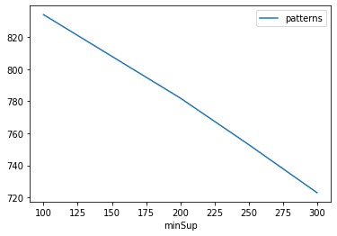
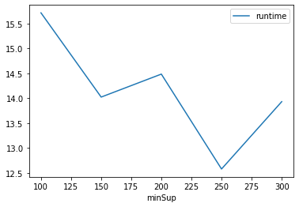
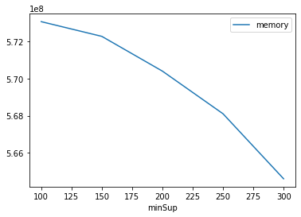

# Advanced Tutorial on Implementing EPCPGrowth Algorithm

In this tutorial, we will discuss the first approach to find Correlated Periodic Frequent patterns in big data using EPCPGrowth algorithm.

[__Advanced approach:__](#advApproach) Here, we generalize the basic approach by presenting the steps to discover Correlated Periodic Frequent patterns using multiple minimum support values.

***

#### In this tutorial, we explain how the EPCPGrowth algorithm  can be implemented by varying the minimum support values

#### Step 1: Import the EPCPGrowth algorithm and pandas data frame


```python
from PAMI.periodicCorrelatedPattern.basic import EPCPGrowth  as alg
import pandas as pd
```

#### Step 2: Specify the following input parameters


```python
inputFile = 'temporal_T10I4D100K.csv'
seperator = '\t'
maxmunPeriodCount = 5000
minimumSupportCountList = [100, 150, 200, 250, 300] 
#minimumSupport can also specified between 0 to 1. E.g., minSupList = [0.005, 0.006, 0.007, 0.008, 0.009]
minAllConfCount = 0.5
maxPerAllmaxPerConfCount = 6.5
result = pd.DataFrame(columns=['algorithm', 'minSup','minAllConf','maxPer','maxPerAllConf', 'patterns', 'runtime', 'memory']) 
#initialize a data frame to store the results of EPCPGrowth algorithm
```

#### Step 3: Execute the EPCPGrowth algorithm using a for loop


```python
algorithm = 'EPCPGrowth'  #specify the algorithm name
for minSupCount in minimumSupportCountList:
    obj = alg.EPCPGrowth('temporal_T10I4D100K.csv', minSup=minSupCount,minAllConf=minAllConfCount,maxPer=maxmunPeriodCount,maxPerAllConf=maxPerAllmaxPerConfCount, sep=seperator)
    obj.startMine()
    #store the results in the data frame
    result.loc[result.shape[0]] = [algorithm, minSupCount,minAllConfCount,maxmunPeriodCount, maxPerAllmaxPerConfCount,len(obj.getPatterns()), obj.getRuntime(), obj.getMemoryRSS()]
```

    Correlated Periodic-Frequent patterns were generated successfully using EPCPGrowth algorithm 
    Correlated Periodic-Frequent patterns were generated successfully using EPCPGrowth algorithm 
    Correlated Periodic-Frequent patterns were generated successfully using EPCPGrowth algorithm 
    Correlated Periodic-Frequent patterns were generated successfully using EPCPGrowth algorithm 
    Correlated Periodic-Frequent patterns were generated successfully using EPCPGrowth algorithm 


```python
print(result)
```

        algorithm  minSup  minAllConf  maxPer  maxPerAllConf  patterns    runtime  \
    0  EPCPGrowth     100         0.5    5000            6.5       834  15.714894   
    1  EPCPGrowth     150         0.5    5000            6.5       808  14.021492   
    2  EPCPGrowth     200         0.5    5000            6.5       782  14.483279   
    3  EPCPGrowth     250         0.5    5000            6.5       753  12.575437   
    4  EPCPGrowth     300         0.5    5000            6.5       723  13.929345   
    
          memory  
    0  573054976  
    1  572264448  
    2  570396672  
    3  568107008  
    4  564613120  


#### Step 5: Visualizing the results

##### Step 5.1 Importing the plot library


```python
from PAMI.extras.graph import plotLineGraphsFromDataFrame as plt
```

##### Step 5.2. Plotting the number of patterns


```python
ab = plt.plotGraphsFromDataFrame(result)
ab.plotGraphsFromDataFrame() #drawPlots()
```


    

    


    Graph for No Of Patterns is successfully generated!


    

    


    Graph for Runtime taken is successfully generated!


    

    


    Graph for memory consumption is successfully generated!


### Step 6: Saving the results as latex files


```python
from PAMI.extras.graph import generateLatexFileFromDataFrame as gdf
gdf.generateLatexCode(result)
```

    Latex files generated successfully

