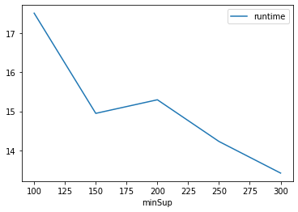
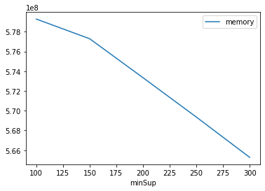

# Advanced Tutorial on Implementing PFPGrowth Algorithm

In this tutorial, we will discuss the second approaches to find Periodic Frequent patterns in big data using PFPGrowth++ algorithm.

[__Advanced approach:__](#advApproach) Here, we generalize the basic approach by presenting the steps to discover Periodic Frequent patterns using multiple minimum support values.

***

#### In this tutorial, we explain how the Periodic Frequent Puttern Growth (PFPGrowth) algorithm  can be implemented by varying the minimum support values

#### Step 1: Import the PFPGrowth algorithm and pandas data frame


```python
from PAMI.periodicFrequentPattern.basic import PFPGrowth  as alg
import pandas as pd
```

#### Step 2: Specify the following input parameters


```python
inputFile = 'temporal_T10I4D100K.csv'
seperator = '\t'
maxmunPeriodCount = 5000
minimumSupportCountList = [100, 150, 200, 250, 300] 
#minimumSupport can also specified between 0 to 1. E.g., minSupList = [0.005, 0.006, 0.007, 0.008, 0.009]

result = pd.DataFrame(columns=['algorithm', 'minSup','maxPer', 'patterns', 'runtime', 'memory']) 
#initialize a data frame to store the results of PFPGrowth algorithm
```

#### Step 3: Execute the PFPGrowth algorithm using a for loop


```python
algorithm = 'PFPGrowth'  #specify the algorithm name
for minSupCount in minimumSupportCountList:
    obj = alg.PFPGrowth('temporal_T10I4D100K.csv', minSup=minSupCount,maxPer=maxmunPeriodCount, sep=seperator)
    obj.startMine()
    #store the results in the data frame
    result.loc[result.shape[0]] = [algorithm, minSupCount,maxmunPeriodCount, len(obj.getPatterns()), obj.getRuntime(), obj.getMemoryRSS()]

```

    Periodic Frequent patterns were generated successfully using PFPGrowth algorithm 
    Periodic Frequent patterns were generated successfully using PFPGrowth algorithm 
    Periodic Frequent patterns were generated successfully using PFPGrowth algorithm 
    Periodic Frequent patterns were generated successfully using PFPGrowth algorithm 
    Periodic Frequent patterns were generated successfully using PFPGrowth algorithm 


```python
print(result)
```

       algorithm  minSup  maxPer  patterns    runtime     memory
    0  PFPGrowth     100    5000     25462  17.511031  579276800
    1  PFPGrowth     150    5000     18982  14.946612  577286144
    2  PFPGrowth     200    5000     13251  15.294498  573341696
    3  PFPGrowth     250    5000      7702  14.227242  569356288
    4  PFPGrowth     300    5000      4552  13.418274  565276672


#### Step 5: Visualizing the results

##### Step 5.1 Importing the plot library


```python
from PAMI.extras.graph import plotLineGraphsFromDataFrame as plt
```

##### Step 5.2. Plotting the number of patterns


```python
ab = plt.plotGraphsFromDataFrame(result)
ab.plotGraphsFromDataFrame() #drawPlots()
```


    

    


    Graph for No Of Patterns is successfully generated!


    

    


    Graph for Runtime taken is successfully generated!


    

    


    Graph for memory consumption is successfully generated!


### Step 6: Saving the results as latex files

```python
from PAMI.extras.graph import DF2Tex as gdf

gdf.generateLatexCode(result)
```

    Latex files generated successfully

