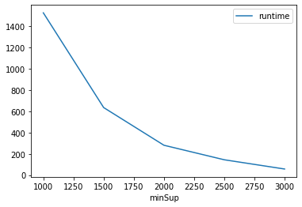
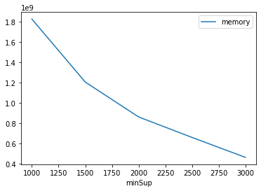

# Advanced Tutorial on Implementing PFPMC Algorithm

In this tutorial, we will discuss the first approach to find Periodic-Frequent patterns in big data using PFPMC algorithm.

[__Advanced approach:__](#advApproach) Here, we generalize the basic approach by presenting the steps to discover Periodic-Frequent patterns using multiple minimum support values.

***

#### In this tutorial, we explain how the PFPMC algorithm  can be implemented by varying the minimum support values

#### Step 1: Import the PFPMC algorithm and pandas data frame


```python
from PAMI.periodicFrequentPattern.basic import PFPMC  as alg
import pandas as pd
```

#### Step 2: Specify the following input parameters


```python
inputFile = 'temporal_T10I4D100K.csv'
seperator = '\t'
maxmunPeriodCount = 5000
minimumSupportCountList = [1000, 1500, 2000, 2500, 3000] 
#minimumSupport can also specified between 0 to 1. E.g., minSupList = [0.005, 0.006, 0.007, 0.008, 0.009]

result = pd.DataFrame(columns=['algorithm', 'minSup', 'maxPer','patterns', 'runtime', 'memory']) 
#initialize a data frame to store the results of PFPMC algorithm
```

#### Step 3: Execute the PFPMC algorithm using a for loop


```python
algorithm = 'PFPMC'  #specify the algorithm name
for minSupCount in minimumSupportCountList:
    obj = alg.PFPMC(iFile=inputFile, minSup=minSupCount,maxPer=maxmunPeriodCount, sep=seperator)
    obj.startMine()
    #store the results in the data frame
    result.loc[result.shape[0]] = [algorithm, minSupCount,maxmunPeriodCount, len(obj.getPatterns()), obj.getRuntime(), obj.getMemoryRSS()]

```

    Periodic-Frequent patterns were generated successfully using PFPDiffset ECLAT algorithm 
    Periodic-Frequent patterns were generated successfully using PFPDiffset ECLAT algorithm 
    Periodic-Frequent patterns were generated successfully using PFPDiffset ECLAT algorithm 
    Periodic-Frequent patterns were generated successfully using PFPDiffset ECLAT algorithm 
    Periodic-Frequent patterns were generated successfully using PFPDiffset ECLAT algorithm 


```python
print(result)
```

      algorithm  minSup  maxPer  patterns      runtime      memory
    0     PFPMC    1000    5000       385  1525.650484  1823825920
    1     PFPMC    1500    5000       237   635.247543  1204428800
    2     PFPMC    2000    5000       155   280.779971   861159424
    3     PFPMC    2500    5000       107   144.305813   659865600
    4     PFPMC    3000    5000        60    57.411468   463773696


#### Step 5: Visualizing the results

##### Step 5.1 Importing the plot library


```python
from PAMI.extras.graph import plotLineGraphsFromDataFrame as plt
```

##### Step 5.2. Plotting the number of patterns


```python
ab = plt.plotGraphsFromDataFrame(result)
ab.plotGraphsFromDataFrame() #drawPlots()
```


    

    


    Graph for No Of Patterns is successfully generated!


    

    


    Graph for Runtime taken is successfully generated!


    

    


    Graph for memory consumption is successfully generated!


### Step 6: Saving the results as latex files


```python
from PAMI.extras.graph import generateLatexFileFromDataFrame as gdf
gdf.generateLatexCode(result)
```

    Latex files generated successfully

