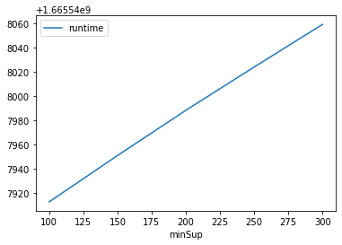
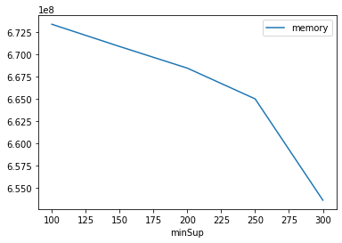

# Advanced Tutorial on Implementing PSGrowth Algorithm


In this tutorial, we will discuss the second approach to find Periodic Frequent patterns in big data using PSGrowth algorithm.

[__Advanced approach:__](#advApproach) Here, we generalize the basic approach by presenting the steps to discover Periodic Frequent patterns using multiple minimum support values.

***

#### In this tutorial, we explain how the PSGrowth algorithm  can be implemented by varying the minimum support values

#### Step 1: Import the PSGrowth algorithm and pandas data frame


```python
from PAMI.periodicFrequentPattern.basic import PSGrowth  as alg
import pandas as pd
```

#### Step 2: Specify the following input parameters


```python
inputFile = 'temporal_T10I4D100K.csv'
seperator = '\t'
maximumPeriodCount = 5000
minimumSupportCountList = [100, 150, 200, 250, 300] 
#minimumSupport can also specified between 0 to 1. E.g., minSupList = [0.005, 0.006, 0.007, 0.008, 0.009]

result = pd.DataFrame(columns=['algorithm', 'minSup','maxPer',  'patterns','runtime', 'memory']) 
#initialize a data frame to store the results of PSGrowth algorithm
```

#### Step 3: Execute the PSGrowth algorithm using a for loop


```python
algorithm = 'PSGrowth'  #specify the algorithm name
for minSupCount in minimumSupportCountList:
    obj = alg.PSGrowth(iFile=inputFile, minSup=minSupCount,maxPer=maximumPeriodCount, sep=seperator)
    obj.startMine()
    #store the results in the data frame
    result.loc[result.shape[0]] = [algorithm, minSupCount,maximumPeriodCount, len(obj.getPatterns()), obj.getRuntime(), obj.getMemoryRSS()]

```

    Periodic-Frequent patterns were generated successfully using PS-Growth algorithm 
    Periodic-Frequent patterns were generated successfully using PS-Growth algorithm 
    Periodic-Frequent patterns were generated successfully using PS-Growth algorithm 
    Periodic-Frequent patterns were generated successfully using PS-Growth algorithm 
    Periodic-Frequent patterns were generated successfully using PS-Growth algorithm 


#### Step 4: Print the result


```python
print(result)
```

      algorithm  minSup  maxPer  patterns       runtime     memory
    0  PSGrowth     100    5000     25462  1.665548e+09  673390592
    1  PSGrowth     150    5000     18982  1.665548e+09  670896128
    2  PSGrowth     200    5000     13251  1.665548e+09  668467200
    3  PSGrowth     250    5000      7702  1.665548e+09  665022464
    4  PSGrowth     300    5000      4552  1.665548e+09  653656064


#### Step 5: Visualizing the results

##### Step 5.1 Importing the plot library


```python
from PAMI.extras.graph import plotLineGraphsFromDataFrame as plt
```

##### Step 5.2. Plotting the number of patterns


```python
ab = plt.plotGraphsFromDataFrame(result)
ab.plotGraphsFromDataFrame() #drawPlots()
```


    

    


    Graph for No Of Patterns is successfully generated!


    

    


    Graph for Runtime taken is successfully generated!


    

    


    Graph for memory consumption is successfully generated!


### Step 6: Saving the results as latex files


```python
from PAMI.extras.graph import generateLatexFileFromDataFrame as gdf
gdf.generateLatexCode(result)
```

    Latex files generated successfully

