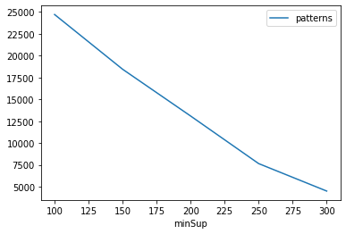
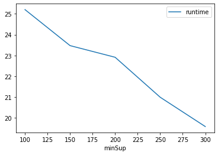
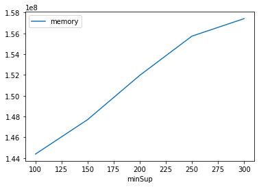

# Advanced Tutorial on Implementing CPFPMiner Algorithm

In this tutorial, we will discuss the second approach to find Closed periodic frequent patterns in big data using CPFPMiner algorithm.

[__Advanced approach:__](#advApproach) Here, we generalize the basic approach by presenting the steps to discover Closed periodic frequent patterns using multiple minimum support values.

***

#### In this tutorial, we explain how the CPFPMiner (CPFPMiner) algorithm  can be implemented by varying the minimum support values

#### Step 1: Import the CPFPMiner algorithm and pandas data frame


```python
from PAMI.periodicFrequentPattern.closed import CPFPMiner  as alg
import pandas as pd
```

#### Step 2: Specify the following input parameters


```python
inputFile = 'temporal_T10I4D100K.csv'
seperator = '\t'
maximumPeriodCount = 5000
minimumSupportCountList = [100, 150, 200, 250, 300] 
#minimumSupport can also specified between 0 to 1. E.g., minSupList = [0.005, 0.006, 0.007, 0.008, 0.009]

result = pd.DataFrame(columns=['algorithm', 'minSup', 'maxPer','patterns', 'runtime', 'memory']) 
#initialize a data frame to store the results of CPFPMiner algorithm
```

#### Step 3: Execute the CPFPMiner algorithm using a for loop


```python
algorithm = 'CPFPMiner'  #specify the algorithm name
for minSupCount in minimumSupportCountList:
    obj = alg.CPFPMiner(iFile=inputFile, minSup=minSupCount,maxPer=maximumPeriodCount, sep=seperator)
    obj.startMine()
    #store the results in the data frame
    result.loc[result.shape[0]] = [algorithm, minSupCount,maximumPeriodCount, len(obj.getPatterns()), obj.getRuntime(), obj.getMemoryRSS()]

```

    Closed periodic frequent patterns were generated successfully using CPFPMiner algorithm 
    Closed periodic frequent patterns were generated successfully using CPFPMiner algorithm 
    Closed periodic frequent patterns were generated successfully using CPFPMiner algorithm 
    Closed periodic frequent patterns were generated successfully using CPFPMiner algorithm 
    Closed periodic frequent patterns were generated successfully using CPFPMiner algorithm 


```python
print(result)
```

       algorithm  minSup  maxPer  patterns    runtime     memory
    0  CPFPMiner     100    5000     24711  25.206203  144384000
    1  CPFPMiner     150    5000     18448  23.474561  147701760
    2  CPFPMiner     200    5000     13095  22.913724  151961600
    3  CPFPMiner     250    5000      7651  20.990680  155734016
    4  CPFPMiner     300    5000      4509  19.581053  157417472


#### Step 5: Visualizing the results

##### Step 5.1 Importing the plot library


```python
from PAMI.extras.graph import plotLineGraphsFromDataFrame as plt
```

##### Step 5.2. Plotting the number of patterns


```python
ab = plt.plotGraphsFromDataFrame(result)
ab.plotGraphsFromDataFrame() #drawPlots()
```


    

    


    Graph for No Of Patterns is successfully generated!


    

    


    Graph for Runtime taken is successfully generated!


    

    


    Graph for memory consumption is successfully generated!


### Step 6: Saving the results as latex files

```python
from PAMI.extras.graph import DF2Tex as gdf

gdf.generateLatexCode(result)
```

    Latex files generated successfully

