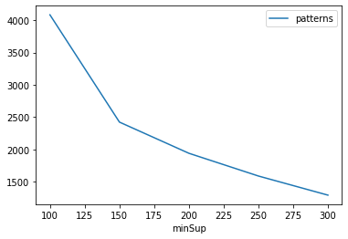
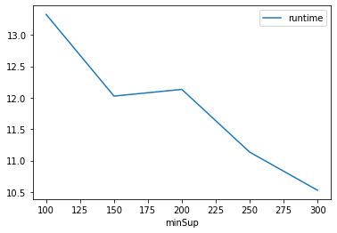
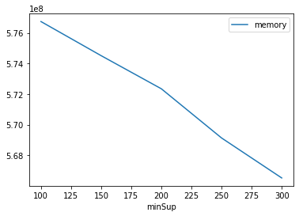

# Advanced Tutorial on Implementing MaxPFGrowth Algorithm

In this tutorial, we will discuss the second approach to find Maximal Periodic Frequent patterns in big data using top algorithm.

 [__Advanced approach:__](#advApproach) Here, we generalize the basic approach by presenting the steps to discover Maximal Periodic Frequent patterns using multiple minimum support values.

***

#### In this tutorial, we explain how the Maximal Periodic FrequentGrowth (MaxPFGrowth) algorithm  can be implemented by varying the minimum support values

#### Step 1: Import the MaxPFGrowth algorithm and pandas data frame


```python
from PAMI.periodicFrequentPattern.maximal import MaxPFGrowth  as alg
import pandas as pd
```

#### Step 2: Specify the following input parameters


```python
inputFile = 'temporal_T10I4D100K.csv'
seperator = '\t'
maximumPeriodCount = 50000
minimumSupportCountList = [100, 150, 200, 250, 300] 
#minimumSupport can also specified between 0 to 1. E.g., minSupList = [0.005, 0.006, 0.007, 0.008, 0.009]

result = pd.DataFrame(columns=['algorithm', 'minSup','maxPer', 'patterns', 'runtime', 'memory']) 
#initialize a data frame to store the results of MaxPFGrowth algorithm
```

#### Step 3: Execute the MaxPFGrowth algorithm using a for loop


```python
algorithm = 'MaxPFGrowth'  #specify the algorithm name
for minSupCount in minimumSupportCountList:
    obj = alg.MaxPFGrowth('temporal_T10I4D100K.csv', minSup=minSupCount,maxPer=maximumPeriodCount, sep=seperator)
    obj.startMine()
    #store the results in the data frame
    result.loc[result.shape[0]] = [algorithm, minSupCount,maximumPeriodCount, len(obj.getPatterns()), obj.getRuntime(), obj.getMemoryRSS()]

```

    Maximal Periodic Frequent patterns were generated successfully using MAX-PFPGrowth algorithm 
    Maximal Periodic Frequent patterns were generated successfully using MAX-PFPGrowth algorithm 
    Maximal Periodic Frequent patterns were generated successfully using MAX-PFPGrowth algorithm 
    Maximal Periodic Frequent patterns were generated successfully using MAX-PFPGrowth algorithm 
    Maximal Periodic Frequent patterns were generated successfully using MAX-PFPGrowth algorithm 


```python
print(result)
```

         algorithm  minSup  maxPer  patterns    runtime     memory
    0  MaxPFGrowth     100   50000      4083  13.325306  576737280
    1  MaxPFGrowth     150   50000      2422  12.025802  574509056
    2  MaxPFGrowth     200   50000      1939  12.132649  572346368
    3  MaxPFGrowth     250   50000      1587  11.133983  569135104
    4  MaxPFGrowth     300   50000      1291  10.527438  566521856


#### Step 5: Visualizing the results

##### Step 5.1 Importing the plot library


```python
from PAMI.extras.graph import plotLineGraphsFromDataFrame as plt
```

##### Step 5.2. Plotting the number of patterns


```python
ab = plt.plotGraphsFromDataFrame(result)
ab.plotGraphsFromDataFrame() #drawPlots()
```


    

    


    Graph for No Of Patterns is successfully generated!


    

    


    Graph for Runtime taken is successfully generated!


    

    


    Graph for memory consumption is successfully generated!


### Step 6: Saving the results as latex files


```python
from PAMI.extras.graph import generateLatexFileFromDataFrame as gdf
gdf.generateLatexCode(result)
```

    Latex files generated successfully

