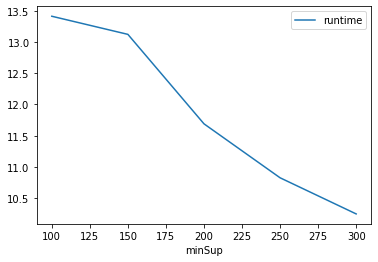
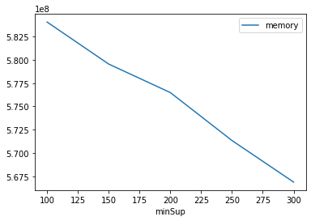

# Advanced Tutorial on Implementing RPGrowth Algorithm

In this tutorial, we will discuss the second approaches to find Relative Periodic Frequent patterns in big data using RPGrowth algorithm.

[__Advanced approach:__](#advApproach) Here, we generalize the basic approach by presenting the steps to discover Relative Periodic Frequent patterns using multiple minimum support values with fixed maximum period and minimum recurrence value.

***

#### In this tutorial, we explain how the Relative Periodic Frequent Pattern Growth (RPGrowth) algorithm  can be implemented by varying the minimum support values

#### Step 1: Import the RPGrowth algorithm and pandas data frame


```python
from PAMI.recurringPattern.basic import RPGrowth as alg
import pandas as pd
```

#### Step 2: Specify the following input parameters


```python
inputFile = 'temporal_T10I4D100K.csv'
seperator = '\t'
maximumPeriodCount = 5000
minimumSupportCountList = [100, 150, 200, 250, 300] 
minRec = 1.5
#minimumSupport can also specified between 0 to 1. E.g., minSupList = [0.005, 0.006, 0.007, 0.008, 0.009]

result = pd.DataFrame(columns=['algorithm', 'minSup','maxPer', 'patterns', 'runtime', 'memory']) 
#initialize a data frame to store the results of PFPGrowth algorithm
```

#### Step 3: Execute the PFPGrowth algorithm using a for loop


```python
algorithm = 'RPGrowth'  #specify the algorithm name
for minSupCount in minimumSupportCountList:
    obj = alg.RPGrowth('temporal_T10I4D100K.csv', minPS=minSupCount, maxPer=maximumPeriodCount, minRec=minRec, sep=seperator)
    obj.startMine()
    #store the results in the data frame
    result.loc[result.shape[0]] = [algorithm, minSupCount,maximumPeriodCount, len(obj.getPatterns()), obj.getRuntime(), obj.getMemoryRSS()]

```

    Recurring patterns were generated successfully using RPGrowth algorithm 
    Recurring patterns were generated successfully using RPGrowth algorithm 
    Recurring patterns were generated successfully using RPGrowth algorithm 
    Recurring patterns were generated successfully using RPGrowth algorithm 
    Recurring patterns were generated successfully using RPGrowth algorithm 


```python
print(result)
```

      algorithm  minSup  maxPer  patterns    runtime     memory
    0  RPGrowth     100    5000     25965  13.410950  584056832
    1  RPGrowth     150    5000     18989  13.121199  579547136
    2  RPGrowth     200    5000     13252  11.691187  576487424
    3  RPGrowth     250    5000      7702  10.828380  571342848
    4  RPGrowth     300    5000      4552  10.250728  566882304


#### Step 5: Visualizing the results

##### Step 5.1 Importing the plot library


```python
from PAMI.extras.graph import plotLineGraphsFromDataFrame as plt
```

##### Step 5.2. Plotting the number of patterns


```python
ab = plt.plotGraphsFromDataFrame(result)
ab.plotGraphsFromDataFrame() #drawPlots()
```


    

    


    Graph for No Of Patterns is successfully generated!


    

    


    Graph for Runtime taken is successfully generated!


    

    


    Graph for memory consumption is successfully generated!


### Step 6: Saving the results as latex files


```python
from PAMI.extras.graph import generateLatexFileFromDataFrame as gdf
gdf.generateLatexCode(result)
```

    Latex files generated successfully

