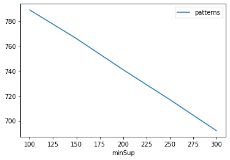
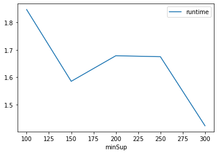
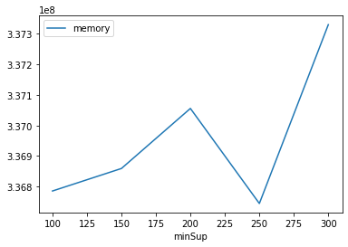

# Advanced Tutorial on Implementing PFS_ECLAT Algorithm

In this tutorial, we will discuss the second approach to find Spatial Periodic Frequent patterns in big data using GPFPMiner algorithm.

[__Advanced approach:__](#advApproach) Here, we generalize the basic approach by presenting the steps to discover Spatial Periodic Frequent patterns using multiple minimum support values.

***

#### In this tutorial, we explain how the Periodic Frequent Spatial Pattern Growth(GPFPMiner) algorithm  can be implemented by varying the minimum support values

#### Step 1: Import the GPFPMiner algorithm and pandas data frame


```python
from PAMI.geoReferencedPeriodicFrequentPattern.basic import GPFPMiner  as alg
import pandas as pd
```

#### Step 2: Specify the following input parameters


```python
inputFile = 'temporal_T10I4D100K.csv'
seperator = '\t'
maximumPeriodCount = 5000
minimumSupportCountList = [100, 150, 200, 250, 300] 
#minimumSupport can also specified between 0 to 1. E.g., minSupList = [0.005, 0.006, 0.007, 0.008, 0.009]
neighborFile='t10_neighbours.txt'
result = pd.DataFrame(columns=['algorithm', 'minSup', 'maxPer','patterns', 'runtime', 'memory']) 
#initialize a data frame to store the results of PFS_ECLAT algorithm
```

#### Step 3: Execute the GPFPMiner algorithm using a for loop


```python
algorithm = 'GPFPMiner'  #specify the algorithm name
for minSupCount in minimumSupportCountList:
    obj = alg.GPFPMiner(inputFile, minSup=minSupCount,maxPer=maximumPeriodCount,nFile=neighborFile, sep=seperator)
    obj.startMine()
    #store the results in the data frame
    result.loc[result.shape[0]] = [algorithm, minSupCount,maximumPeriodCount, len(obj.getPatterns()), obj.getRuntime(), obj.getMemoryRSS()]

```

    100 5000
    Spatial Periodic Frequent patterns were generated successfully using SpatialEclat algorithm
    150 5000
    Spatial Periodic Frequent patterns were generated successfully using SpatialEclat algorithm
    200 5000
    Spatial Periodic Frequent patterns were generated successfully using SpatialEclat algorithm
    250 5000
    Spatial Periodic Frequent patterns were generated successfully using SpatialEclat algorithm
    300 5000
    Spatial Periodic Frequent patterns were generated successfully using SpatialEclat algorithm


#### Step 4: Print the result


```python
print(result)
```

       algorithm  minSup  maxPer  patterns   runtime     memory
    0  GPFPMiner     100    5000       789  1.847106  336785408
    1  GPFPMiner     150    5000       766  1.584674  336859136
    2  GPFPMiner     200    5000       741  1.678147  337055744
    3  GPFPMiner     250    5000       717  1.674733  336744448
    4  GPFPMiner     300    5000       692  1.422192  337330176


#### Step 5: Visualizing the results

##### Step 5.1 Importing the plot library


```python
from PAMI.extras.graph import plotLineGraphsFromDataFrame as plt
```

##### Step 5.2. Plotting the number of patterns


```python
ab = plt.plotGraphsFromDataFrame(result)
ab.plotGraphsFromDataFrame() #drawPlots()
```


    

    


    Graph for No Of Patterns is successfully generated!


    

    


    Graph for Runtime taken is successfully generated!


    

    


    Graph for memory consumption is successfully generated!


### Step 6: Saving the results as latex files


```python
from PAMI.extras.graph import generateLatexFileFromDataFrame as gdf
gdf.generateLatexCode(result)
```

    Latex files generated successfully


```python

```
