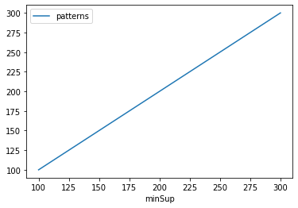
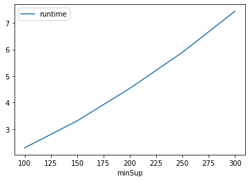
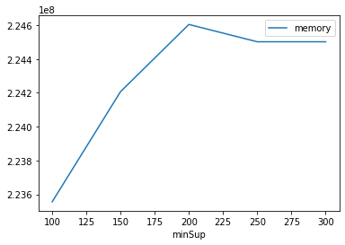

# Advanced Tutorial on Implementing kPFPMiner Algorithm

In this tutorial, we will discuss the second approach to find top-k Periodic Frequent patterns in big data using kPFPMiner algorithm.

[__Advanced approach:__](#advApproach) Here, we generalize the basic approach by presenting the steps to discover top-k Periodic Frequent patterns using multiple k values.

***

#### In this tutorial, we explain how the ToP-K Periodic Frequent Miner (kPFPMiner) algorithm  can be implemented by varying the k values

#### Step 1: Import the kPFPMiner algorithm and pandas data frame


```python
from PAMI.periodicFrequentPattern.topk.kPFPMiner import kPFPMiner as alg
import pandas as pd
```

#### Step 2: Specify the following input parameters


```python
inputFile = 'temporal_T10I4D100K.csv'
seperator = '\t'
k = [100, 150, 200, 250, 300] 
#minimumSupport can also specified between 0 to 1. E.g., minSupList = [0.005, 0.006, 0.007, 0.008, 0.009]

result = pd.DataFrame(columns=['algorithm', 'minSup', 'patterns', 'runtime', 'memory']) 
#initialize a data frame to store the results of PFECLAT algorithm
```

#### Step 3: Execute the kPFPMiner algorithm using a for loop


```python
algorithm = 'kPFPMiner'  #specify the algorithm name
for i in k:
    obj = alg.kPFPMiner('temporal_T10I4D100K.csv', k=i, sep=seperator)
    obj.startMine()
    #store the results in the data frame
    result.loc[result.shape[0]] = [algorithm, i, len(obj.getPatterns()), obj.getRuntime(), obj.getMemoryRSS()]

```

    kPFPMiner has successfully generated top-k frequent patterns
    kPFPMiner has successfully generated top-k frequent patterns
    kPFPMiner has successfully generated top-k frequent patterns
    kPFPMiner has successfully generated top-k frequent patterns
    kPFPMiner has successfully generated top-k frequent patterns


```python
print(result)
```

       algorithm  minSup  patterns   runtime     memory
    0  kPFPMiner     100       100  2.292819  223555584
    1  kPFPMiner     150       150  3.309900  224206848
    2  kPFPMiner     200       200  4.534449  224604160
    3  kPFPMiner     250       250  5.890688  224501760
    4  kPFPMiner     300       300  7.441525  224501760


#### Step 5: Visualizing the results

##### Step 5.1 Importing the plot library


```python
from PAMI.extras.graph import plotLineGraphsFromDataFrame as plt
```

##### Step 5.2. Plotting the number of patterns


```python
ab = plt.plotGraphsFromDataFrame(result)
ab.plotGraphsFromDataFrame() #drawPlots()
```


    

    


    Graph for No Of Patterns is successfully generated!


    

    


    Graph for Runtime taken is successfully generated!


    

    


    Graph for memory consumption is successfully generated!


### Step 6: Saving the results as latex files


```python
from PAMI.extras.graph import generateLatexFileFromDataFrame as gdf
gdf.generateLatexCode(result)
```

    Latex files generated successfully

