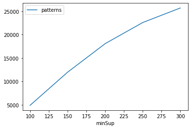
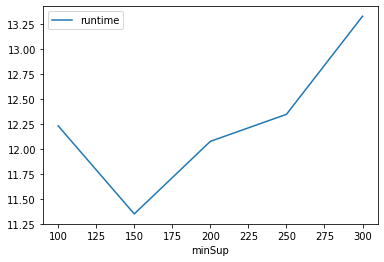
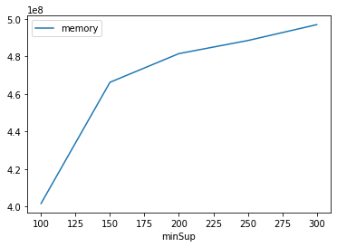

# Advanced Tutorial on Implementing RSFPGrowth Algorithm

In this tutorial, we will discuss the second approach to find frequent patterns in big data using RSFPGrowth algorithm.

[__Advanced approach:__](#advApproach) Here, we generalize the basic approach by presenting the steps to discover frequent patterns using multiple minimum support values.

***

#### In this tutorial, we explain how the RSFPGrowth algorithm  can be implemented by varying the minimum support values

#### Step 1: Import the RSFPGrowth algorithm and pandas data frame


```python
from PAMI.frequentPatternUsingOtherMeasures import RSFPGrowth  as alg
import pandas as pd
```

#### Step 2: Specify the following input parameters


```python
inputFile = 'transactional_T10I4D100K.csv'
seperator='\t'
minimumSupportCountList = [100, 150, 200, 250, 300] 
#minimumSupport can also specified between 0 to 1. E.g., minSupList = [0.005, 0.006, 0.007, 0.008, 0.009]
minRatioEx=0.5
result = pd.DataFrame(columns=['algorithm', 'minSup', 'patterns', 'runtime', 'memory']) 
#initialize a data frame to store the results of RSFPGrowth algorithm
```

#### Step 3: Execute the RSFPGrowth algorithm using a for loop


```python
algorithm = 'RSFPGrowth'  #specify the algorithm name
for minSupCount in minimumSupportCountList:
    obj = alg.RSFPGrowth(iFile=inputFile, minSup=minSupCount,minRatio=minRatioEx, sep=seperator)
    obj.startMine()
    #store the results in the data frame
    result.loc[result.shape[0]] = [algorithm, minSupCount, len(obj.getPatterns()), obj.getRuntime(), obj.getMemoryRSS()]

```

    Relative support frequent patterns were generated successfully using RSFPGrowth algorithm
    Relative support frequent patterns were generated successfully using RSFPGrowth algorithm
    Relative support frequent patterns were generated successfully using RSFPGrowth algorithm
    Relative support frequent patterns were generated successfully using RSFPGrowth algorithm
    Relative support frequent patterns were generated successfully using RSFPGrowth algorithm


```python
print(result)
```

        algorithm  minSup  patterns    runtime     memory
    0  RSFPGrowth     100      4890  12.228889  401653760
    1  RSFPGrowth     150     11979  11.348294  466202624
    2  RSFPGrowth     200     18087  12.073989  481480704
    3  RSFPGrowth     250     22602  12.343794  488443904
    4  RSFPGrowth     300     25711  13.324610  496902144


#### Step 5: Visualizing the results

##### Step 5.1 Importing the plot library


```python
from PAMI.extras.graph import plotLineGraphsFromDataFrame as plt
```

##### Step 5.2. Plotting the number of patterns


```python
ab = plt.plotGraphsFromDataFrame(result)
ab.plotGraphsFromDataFrame() #drawPlots()
```


    

    


    Graph for No Of Patterns is successfully generated!


    

    


    Graph for Runtime taken is successfully generated!


    

    


    Graph for memory consumption is successfully generated!


### Step 6: Saving the results as latex files

```python
from PAMI.extras.graph import DF2Tex as gdf

gdf.generateLatexCode(result)
```

    Latex files generated successfully

