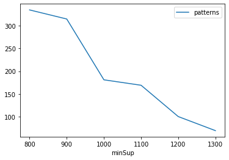
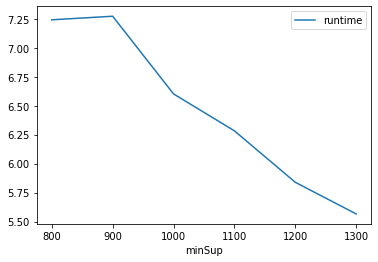
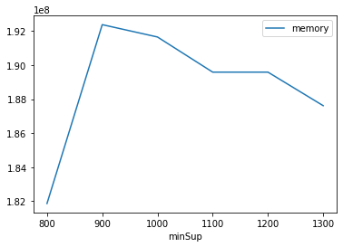

# Advanced Tutorial on Implementing Spade Algorithm
***

#### In this tutorial, we explain how the Spade algorithm  can be implemented by varying the minimum support values

#### Step 1: Import the Spade algorithm and pandas data frame


```python
from PAMI.sequentialPatternMining.basic import SPADE as alg
import pandas as pd
```

#### Step 2: Specify the following input parameters


```python
inputFile = 'sequence_retail.txt'
seperator='\t'
minimumSupportCountList = [800, 900, 1000, 1100, 1200, 1300] 
#minimumSupport can also specified between 0 to 1. E.g., minSupList = [0.005, 0.006, 0.007, 0.008, 0.009]

result = pd.DataFrame(columns=['algorithm', 'minSup', 'patterns', 'runtime', 'memory']) 
#initialize a data frame to store the results of Spade algorithm
```

#### Step 3: Execute the Spade algorithm using a for loop


```python
algorithm = 'Spade'  #specify the algorithm name
for minSupCount in minimumSupportCountList:
    obj = alg.SPADE(inputFile, minSup=minSupCount, sep=seperator)
    obj.startMine()
    #store the results in the data frame
    result.loc[result.shape[0]] = [algorithm, minSupCount, len(obj.getPatterns()), obj.getRuntime(), obj.getMemoryRSS()]

```

    800
    Sequential Frequent patterns were generated successfully using SPADE algorithm 
    900
    Sequential Frequent patterns were generated successfully using SPADE algorithm 
    1000
    Sequential Frequent patterns were generated successfully using SPADE algorithm 
    1100
    Sequential Frequent patterns were generated successfully using SPADE algorithm 
    1200
    Sequential Frequent patterns were generated successfully using SPADE algorithm 
    1300
    Sequential Frequent patterns were generated successfully using SPADE algorithm 


```python
print(result)
```

      algorithm  minSup  patterns   runtime     memory
    0     Spade     800       335  7.241224  181870592
    1     Spade     900       315  7.271861  192376832
    2     Spade    1000       181  6.601485  191651840
    3     Spade    1100       169  6.282741  189587456
    4     Spade    1200       100  5.838784  189587456
    5     Spade    1300        69  5.565741  187617280


#### Step 5: Visualizing the results

##### Step 5.1 Importing the plot library


```python
from PAMI.extras.graph import plotLineGraphsFromDataFrame as plt
```

##### Step 5.2. Plotting the number of patterns


```python
ab = plt.plotGraphsFromDataFrame(result)
ab.plotGraphsFromDataFrame() #drawPlots()
```


    

    


    Graph for No Of Patterns is successfully generated!


    

    


    Graph for Runtime taken is successfully generated!


    

    


    Graph for memory consumption is successfully generated!


### Step 6: Saving the results as latex files

```python
from PAMI.extras.graph import DF2Tex as gdf

gdf.generateLatexCode(result)
```

    Latex files generated successfully


```python

```
