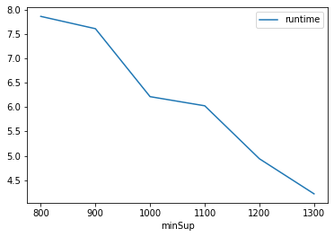
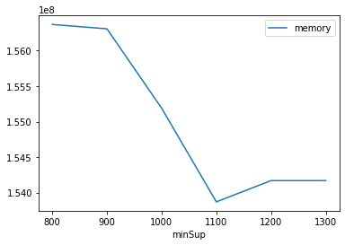

# Advanced Tutorial on Implementing PrifixSpan Algorithm

***

#### In this tutorial, we explain how the PrefixSpan algorithm  can be implemented by varying the minimum support values

#### Step 1: Import the PrefixSpan algorithm and pandas data frame


```python
from PAMI.sequentialPatternMining.basic import prefixSpan as alg
import pandas as pd
```

#### Step 2: Specify the following input parameters


```python
inputFile = 'sequence_retail.txt'
seperator='\t'
minimumSupportCountList = [800, 900, 1000, 1100, 1200, 1300] 
#minimumSupport can also specified between 0 to 1. E.g., minSupList = [0.005, 0.006, 0.007, 0.008, 0.009]

result = pd.DataFrame(columns=['algorithm', 'minSup', 'patterns', 'runtime', 'memory']) 
#initialize a data frame to store the results of PrifixSpan algorithm
```

#### Step 3: Execute the PrefixSpan algorithm using a for loop


```python
algorithm = 'PrefixSpan'  #specify the algorithm name
for minSupCount in minimumSupportCountList:
    obj = alg.prefixSpan(inputFile, minSup=minSupCount, sep=seperator)
    obj.startMine()
    #store the results in the data frame
    result.loc[result.shape[0]] = [algorithm, minSupCount, len(obj.getPatterns()), obj.getRuntime(), obj.getMemoryRSS()]

```

    Frequent patterns were generated successfully using prefixSpan algorithm 
    Frequent patterns were generated successfully using prefixSpan algorithm 
    Frequent patterns were generated successfully using prefixSpan algorithm 
    Frequent patterns were generated successfully using prefixSpan algorithm 
    Frequent patterns were generated successfully using prefixSpan algorithm 
    Frequent patterns were generated successfully using prefixSpan algorithm 


```python
print(result)
```

        algorithm  minSup  patterns   runtime     memory
    0  PrefixSpan     800       335  7.869312  156368896
    1  PrefixSpan     900       315  7.615811  156307456
    2  PrefixSpan    1000       181  6.216822  155189248
    3  PrefixSpan    1100       169  6.028861  153870336
    4  PrefixSpan    1200       100  4.938727  154169344
    5  PrefixSpan    1300        69  4.216516  154169344


#### Step 5: Visualizing the results

##### Step 5.1 Importing the plot library


```python
from PAMI.extras.graph import plotLineGraphsFromDataFrame as plt
```

##### Step 5.2. Plotting the number of patterns


```python
ab = plt.plotGraphsFromDataFrame(result)
ab.plotGraphsFromDataFrame() #drawPlots()
```


    

    


    Graph for No Of Patterns is successfully generated!


    

    


    Graph for Runtime taken is successfully generated!


    

    


    Graph for memory consumption is successfully generated!


### Step 6: Saving the results as latex files


```python
from PAMI.extras.graph import generateLatexFileFromDataFrame as gdf
gdf.generateLatexCode(result)
```

    Latex files generated successfully


```python

```
