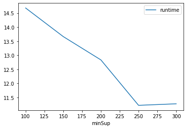
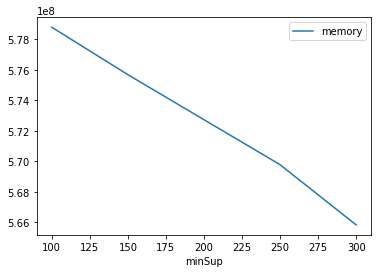

# Advanced Tutorial on Implementing SPPGrowth Algorithm

In this tutorial, we will discuss the second approach to find Stable Periodic Frequent patterns in big data using SPPGrowth algorithm.

[__Advanced approach:__](#advApproach) Here, we generalize the basic approach by presenting the steps to discover Stable Periodic Frequent patterns using multiple minimum support values.

***

#### In this tutorial, we explain how the Stable Periodic Frequent (SPPGrowth) algorithm  can be implemented by varying the minimum support values

#### Step 1: Import the SPPGrowth algorithm and pandas data frame


```python
from PAMI.stablePeriodicFrequentPattern.basic import SPPGrowth as alg
import pandas as pd
```

#### Step 2: Specify the following input parameters


```python
inputFile = 'temporal_T10I4D100K.csv'
seperator = '\t'

maxmunPeriodCount = 5000
minimumSupportCountList = [100, 150, 200, 250, 300] 
#minimumSupport can also specified between 0 to 1. E.g., minSupList = [0.005, 0.006, 0.007, 0.008, 0.009]
maxLaValue = 1000

result = pd.DataFrame(columns=['algorithm', 'minSup', 'maxPer', 'maxLa', 'patterns', 'runtime', 'memory']) 
#initialize a data frame to store the results of PFECLAT algorithm
```

#### Step 3: Execute the SPPGrowth algorithm using a for loop


```python
algorithm = 'SPPGrowth'  #specify the algorithm name
for minSupCount in minimumSupportCountList:
    obj = alg.SPPGrowth('temporal_T10I4D100K.csv', minSup=minSupCount,maxPer=maxmunPeriodCount, maxLa=maxLaValue,  sep=seperator)
    obj.startMine()
    #store the results in the data frame
    result.loc[result.shape[0]] = [algorithm, minSupCount,maxmunPeriodCount, maxLaValue, len(obj.getPatterns()), obj.getRuntime(), obj.getMemoryRSS()]

```

    Stable Periodic Frequent patterns were generated successfully using SPPGrowth algorithm 
    Stable Periodic Frequent patterns were generated successfully using SPPGrowth algorithm 
    Stable Periodic Frequent patterns were generated successfully using SPPGrowth algorithm 
    Stable Periodic Frequent patterns were generated successfully using SPPGrowth algorithm 
    Stable Periodic Frequent patterns were generated successfully using SPPGrowth algorithm 


```python
print(result)
```

       algorithm  minSup  maxPer  maxLa  patterns    runtime     memory
    0  SPPGrowth     100    5000   1000     26974  14.680809  578793472
    1  SPPGrowth     150    5000   1000     19122  13.664508  575680512
    2  SPPGrowth     200    5000   1000     13255  12.835233  572727296
    3  SPPGrowth     250    5000   1000      7703  11.221034  569774080
    4  SPPGrowth     300    5000   1000      4552  11.275074  565821440


#### Step 5: Visualizing the results

##### Step 5.1 Importing the plot library


```python
from PAMI.extras.graph import plotLineGraphsFromDataFrame as plt
```

##### Step 5.2. Plotting the number of patterns


```python
ab = plt.plotGraphsFromDataFrame(result)
ab.plotGraphsFromDataFrame() #drawPlots()
```


    

    


    Graph for No Of Patterns is successfully generated!


    

    


    Graph for Runtime taken is successfully generated!


    

    


    Graph for memory consumption is successfully generated!


### Step 6: Saving the results as latex files


```python
from PAMI.extras.graph import generateLatexFileFromDataFrame as gdf
gdf.generateLatexCode(result)
```

    Latex files generated successfully

