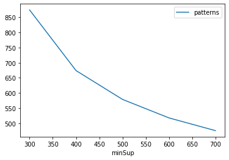
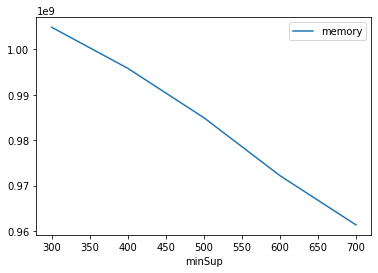

# Advanced Tutorial on Implementing PUFGrowth Algorithm

***

#### In this tutorial, we explain how the PUFGrowth algorithm  can be implemented by varying the minimum support values

#### Step 1: Import the PUFGrowth algorithm and pandas data frame


```python
from PAMI.uncertainFrequentPattern.basic import PUFGrowth  as alg
import pandas as pd
```

#### Step 2: Specify the following input parameters


```python
inputFile = 'uncertainTransaction_T10I4D200K.csv'
seperator = '\t'
minimumSupportCountList = [600, 700, 800, 900, 1000] 
#minimumSupport can also specified between 0 to 1. E.g., minSupList = [0.005, 0.006, 0.007, 0.008, 0.009]
result = pd.DataFrame(columns=['algorithm', 'minSup', 'patterns', 'runtime', 'memory']) 
#initialize a data frame to store the results of PUFGrowth algorithm
```

#### Step 3: Execute the PUFGrowth algorithm using a for loop


```python
algorithm = 'PUFGrowth'  #specify the algorithm name
for minSupCount in minimumSupportCountList:
    obj = alg.PUFGrowth(inputFile, minSup=minSupCount, sep=seperator)
    obj.startMine()
    #store the results in the data frame
    result.loc[result.shape[0]] = [algorithm, minSupCount, obj.getPatterns(), obj.getRuntime(), obj.getMemoryRSS()]

```

    Uncertain Frequent patterns were generated successfully using PUFGrowth algorithm
    Uncertain Frequent patterns were generated successfully using PUFGrowth algorithm
    Uncertain Frequent patterns were generated successfully using PUFGrowth algorithm
    Uncertain Frequent patterns were generated successfully using PUFGrowth algorithm
    Uncertain Frequent patterns were generated successfully using PUFGrowth algorithm


```python
print(result)
```

       algorithm  minSup  patterns    runtime     memory
    0  PUFGrowth     600       518  38.169303  970444800
    1  PUFGrowth     700       476  37.515556  960024576
    2  PUFGrowth     800       441  36.256137  949125120
    3  PUFGrowth     900       403  36.443955  935444480
    4  PUFGrowth    1000       377  36.673288  924991488


#### Step 5: Visualizing the results

##### Step 5.1 Importing the plot library


```python
from PAMI.extras.graph import plotLineGraphsFromDataFrame as plt
```

##### Step 5.2. Plotting the number of patterns


```python
ab = plt.plotGraphsFromDataFrame(result)
ab.plotGraphsFromDataFrame() #drawPlots()
```


    

    


    Graph for No Of Patterns is successfully generated!


    

    


    Graph for Runtime taken is successfully generated!


    

    


    Graph for memory consumption is successfully generated!


### Step 6: Saving the results as latex files


```python
from PAMI.extras.graph import generateLatexFileFromDataFrame as gdf
gdf.generateLatexCode(result)
```

    Latex files generated successfully


```python

```
