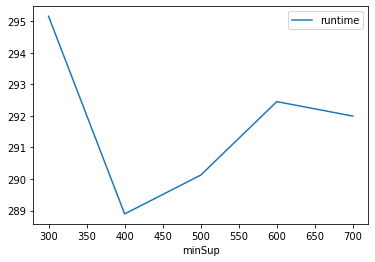
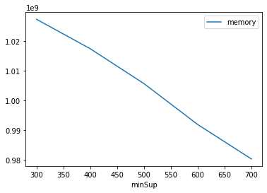

# Advanced Tutorial on Implementing TubeP Algorithm

***

#### In this tutorial, we explain how the TubeP algorithm  can be implemented by varying the minimum support values

#### Step 1: Import the TubeP algorithm and pandas data frame


```python
from PAMI.uncertainFrequentPattern.basic import TubeP  as alg
import pandas as pd
```

#### Step 2: Specify the following input parameters


```python
inputFile = 'uncertainTransaction_T10I4D200K.csv'
seperator = '\t'
minimumSupportCountList = [300, 400, 500, 600, 700] 
#minimumSupport can also specified between 0 to 1. E.g., minSupList = [0.005, 0.006, 0.007, 0.008, 0.009]
result = pd.DataFrame(columns=['algorithm', 'minSup', 'patterns', 'runtime', 'memory']) 
#initialize a data frame to store the results of PUFGrowth algorithm
```

#### Step 3: Execute the TubeP algorithm using a for loop


```python
algorithm = 'TubeP'  #specify the algorithm name
for minSupCount in minimumSupportCountList:
    obj = alg.TubeP(inputFile, minSup=minSupCount, sep=seperator)
    obj.startMine()
    #store the results in the data frame
    result.loc[result.shape[0]] = [algorithm, minSupCount, len(obj.getPatterns()), obj.getRuntime(), obj.getMemoryRSS()]
```

    Total number of false patterns generated: 1969
    Uncertain Frequent patterns were generated successfully using TubeP algorithm
    Total number of false patterns generated: 2169
    Uncertain Frequent patterns were generated successfully using TubeP algorithm
    Total number of false patterns generated: 2264
    Uncertain Frequent patterns were generated successfully using TubeP algorithm
    Total number of false patterns generated: 2325
    Uncertain Frequent patterns were generated successfully using TubeP algorithm
    Total number of false patterns generated: 2367
    Uncertain Frequent patterns were generated successfully using TubeP algorithm


```python
print(result)
```

      algorithm  minSup  patterns     runtime      memory
    0     TubeP     300       874  295.158076  1027391488
    1     TubeP     400       674  288.895234  1017475072
    2     TubeP     500       579  290.124622  1005727744
    3     TubeP     600       518  292.453257   991961088
    4     TubeP     700       476  291.994424   980361216


#### Step 5: Visualizing the results

##### Step 5.1 Importing the plot library


```python
from PAMI.extras.graph import plotLineGraphsFromDataFrame as plt
```

##### Step 5.2. Plotting the number of patterns


```python
ab = plt.plotGraphsFromDataFrame(result)
ab.plotGraphsFromDataFrame() #drawPlots()
```


    

    


    Graph for No Of Patterns is successfully generated!


    

    


    Graph for Runtime taken is successfully generated!


    

    


    Graph for memory consumption is successfully generated!


### Step 6: Saving the results as latex files


```python
from PAMI.extras.graph import generateLatexFileFromDataFrame as gdf
gdf.generateLatexCode(result)
```

    Latex files generated successfully


```python

```
