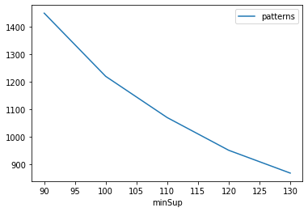
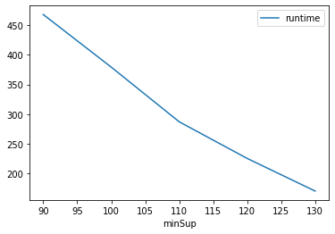
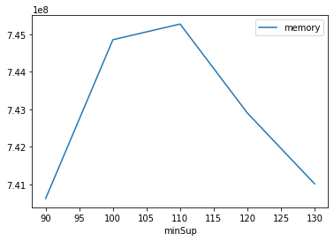

# Advanced Tutorial on Implementing UPFPGrowth Algorithm

***

#### In this tutorial, we explain how the UPFPGrowth algorithm  can be implemented by varying the minimum support values

#### Step 1: Import the UPFPGrowth algorithm and pandas data frame


```python
from PAMI.uncertainPeriodicFrequentPattern.basic import UPFPGrowth as alg
import pandas as pd
```

#### Step 2: Specify the following input parameters


```python
inputFile = 'uncertainTemporal_T10I4D100K.csv'
seperator = '\t'
minimumSupportCountList = [90, 100, 110, 120, 130] 
maxPer = 5000
#minimumSupport can also specified between 0 to 1. E.g., minSupList = [0.005, 0.006, 0.007, 0.008, 0.009]
result = pd.DataFrame(columns=['algorithm', 'minSup', 'patterns', 'runtime', 'memory']) 
#initialize a data frame to store the results of PUFGrowth algorithm
```

#### Step 3: Execute the UPFPGrowth algorithm using a for loop


```python
algorithm = 'basic'  #specify the algorithm name
for minSupCount in minimumSupportCountList:
    obj = alg.UPFPGrowth(inputFile, minSup=minSupCount, maxPer=maxPer, sep=seperator)
    obj.startMine()
    #store the results in the data frame
    result.loc[result.shape[0]] = [algorithm, minSupCount, len(obj.getPatterns()), obj.getRuntime(), obj.getMemoryRSS()]

```

    Periodic frequent patterns were generated successfully using UPFP algorithm
    Periodic frequent patterns were generated successfully using UPFP algorithm
    Periodic frequent patterns were generated successfully using UPFP algorithm
    Periodic frequent patterns were generated successfully using UPFP algorithm
    Periodic frequent patterns were generated successfully using UPFP algorithm


```python
print(result)
```

        algorithm  minSup  patterns     runtime     memory
    0  UPFPGrowth      90      1449  467.981887  740618240
    1  UPFPGrowth     100      1219  379.233200  744853504
    2  UPFPGrowth     110      1069  286.960609  745271296
    3  UPFPGrowth     120       950  225.145050  742899712
    4  UPFPGrowth     130       867  170.093681  741011456


#### Step 5: Visualizing the results

##### Step 5.1 Importing the plot library


```python
from PAMI.extras.graph import plotLineGraphsFromDataFrame as plt
```

##### Step 5.2. Plotting the number of patterns


```python
ab = plt.plotGraphsFromDataFrame(result)
ab.plotGraphsFromDataFrame() #drawPlots()
```


    

    


    Graph for No Of Patterns is successfully generated!


    

    


    Graph for Runtime taken is successfully generated!


    

    


    Graph for memory consumption is successfully generated!


### Step 6: Saving the results as latex files


```python
from PAMI.extras.graph import generateLatexFileFromDataFrame as gdf
gdf.generateLatexCode(result)
```

    Latex files generated successfully


```python

```
