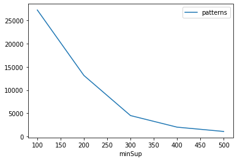
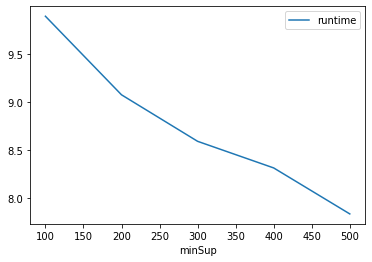
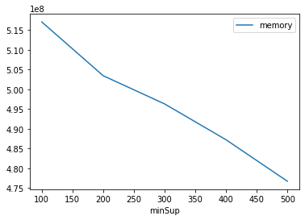

# Advanced Tutorial on Implementing WFIM Algorithm

In this tutorial, we will discuss second approach to find frequent patterns in big data using WFIM algorithm.

[__Advanced approach:__](#advApproach) Here, we generalize the basic approach by presenting the steps to discover weighted frequent patterns using multiple minimum support values.

***

### In this tutorial, we explain how the WFIM algorithm  can be implemented by varying the minimum support values

#### Step 1: Import the WFIM algorithm and pandas data frame


```python
from PAMI.weightedFrequentPattern.basic import WFIM as alg
import pandas as pd
```

#### Step 2: Specify the following input parameters


```python
inputFile = 'Transactional_T10I4D100K.csv'
weightFile = 'T10_weights.txt'
seperator='\t'
minimumSupportCountList = [100, 200, 300, 400, 500] 
minWeight = 100
#minimumSupport can also specified between 0 to 1. E.g., minSupList = [0.005, 0.006, 0.007, 0.008, 0.009]

result = pd.DataFrame(columns=['algorithm', 'minSup', 'patterns', 'runtime', 'memory']) 
#initialize a data frame to store the results of FSPGrowth algorithm
```

#### Step 3: Execute the WFIM algorithm using a for loop


```python
algorithm = 'basic'  #specify the algorithm name
for minSupCount in minimumSupportCountList:
    obj = alg.WFIM(inputFile, wFile=weightFile, minSup=minSupCount, minWeight=minWeight, sep=seperator)
    obj.startMine()
    #store the results in the data frame
    result.loc[result.shape[0]] = [algorithm, minSupCount, len(obj.getPatterns()), obj.getRuntime(), obj.getMemoryRSS()]

```

    Weighted Frequent patterns were generated successfully using WFIM algorithm
    Weighted Frequent patterns were generated successfully using WFIM algorithm
    Weighted Frequent patterns were generated successfully using WFIM algorithm
    Weighted Frequent patterns were generated successfully using WFIM algorithm
    Weighted Frequent patterns were generated successfully using WFIM algorithm


```python
print(result)
```

      algorithm  minSup  patterns   runtime     memory
    0      WFIM     100     27269  9.894492  517070848
    1      WFIM     200     13143  9.077075  503455744
    2      WFIM     300      4493  8.593128  496316416
    3      WFIM     400      1993  8.316134  487247872
    4      WFIM     500      1066  7.837761  476725248


#### Step 5: Visualizing the results

##### Step 5.1 Importing the plot library


```python
from PAMI.extras.graph import plotLineGraphsFromDataFrame as plt
```

##### Step 5.2. Plotting the number of patterns


```python
ab = plt.plotGraphsFromDataFrame(result)
ab.plotGraphsFromDataFrame() #drawPlots()
```


    

    


    Graph for No Of Patterns is successfully generated!


    

    


    Graph for Runtime taken is successfully generated!


    

    


    Graph for memory consumption is successfully generated!


### Step 6: Saving the results as latex files


```python
from PAMI.extras.graph import generateLatexFileFromDataFrame as gdf
gdf.generateLatexCode(result)
```

    Latex files generated successfully


```python

```
