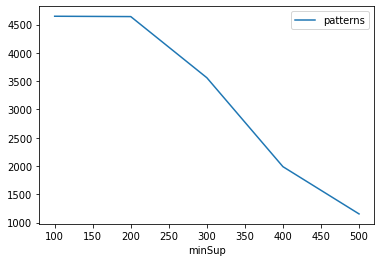
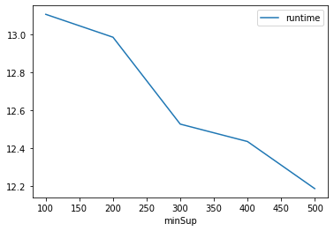
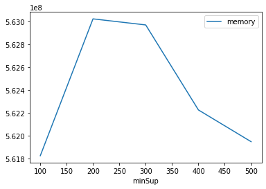

# Advanced Tutorial on Implementing WFRIM Algorithm

In this tutorial, we will discuss second approach to find frequent patterns in big data using WFRIM algorithm.

[__Advanced approach:__](#advApproach) Here, we generalize the basic approach by presenting the steps to discover weighted frequent regular patterns using multiple minimum support values.

***

### In this tutorial, we explain how the WFRIM algorithm  can be implemented by varying the minimum support values

#### Step 1: Import the WFRIM algorithm and pandas data frame


```python
from PAMI.weightedFrequentRegularPattern.basic import WFRIMiner as alg
import pandas as pd
```

#### Step 2: Specify the following input parameters


```python
inputFile = 'temporal_T10I4D100K.csv'
weightFile = 'T10_weights.txt'
seperator='\t'
minimumSupportCountList = [100, 200, 300, 400, 500] 
regularity = 2000
#minimumSupport can also specified between 0 to 1. E.g., minSupList = [0.005, 0.006, 0.007, 0.008, 0.009]

result = pd.DataFrame(columns=['algorithm', 'minSup', 'patterns', 'runtime', 'memory']) 
#initialize a data frame to store the results of FSPGrowth algorithm
```

#### Step 3: Execute the WFIM algorithm using a for loop


```python
algorithm = 'WFRIM'  #specify the algorithm name
for minSupCount in minimumSupportCountList:
    obj = alg.WFRIMiner(inputFile, _wFile=weightFile, WS=minSupCount, regularity=regularity, sep=seperator)
    obj.startMine()
    #store the results in the data frame
    result.loc[result.shape[0]] = [algorithm, minSupCount, len(obj.getPatterns()), obj.getRuntime(), obj.getMemoryRSS()]

```

    Weighted Frequent Regular patterns were generated successfully using WFRIM algorithm
    Weighted Frequent Regular patterns were generated successfully using WFRIM algorithm
    Weighted Frequent Regular patterns were generated successfully using WFRIM algorithm
    Weighted Frequent Regular patterns were generated successfully using WFRIM algorithm
    Weighted Frequent Regular patterns were generated successfully using WFRIM algorithm


```python
print(result)
```

      algorithm  minSup  patterns    runtime     memory
    0     WFRIM     100      4648  13.104086  561823744
    1     WFRIM     200      4642  12.983847  563023872
    2     WFRIM     300      3561  12.527540  562970624
    3     WFRIM     400      1989  12.436150  562225152
    4     WFRIM     500      1154  12.188757  561946624


#### Step 5: Visualizing the results

##### Step 5.1 Importing the plot library


```python
from PAMI.extras.graph import plotLineGraphsFromDataFrame as plt
```

##### Step 5.2. Plotting the number of patterns


```python
ab = plt.plotGraphsFromDataFrame(result)
ab.plotGraphsFromDataFrame() #drawPlots()
```


    

    


    Graph for No Of Patterns is successfully generated!


    

    


    Graph for Runtime taken is successfully generated!


    

    


    Graph for memory consumption is successfully generated!


### Step 6: Saving the results as latex files

```python
from PAMI.extras.graph import DF2Tex as gdf

gdf.generateLatexCode(result)
```

    Latex files generated successfully


```python

```
